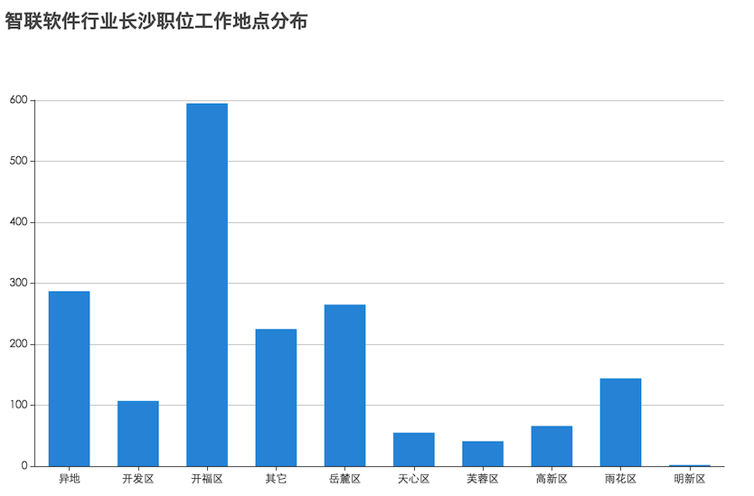
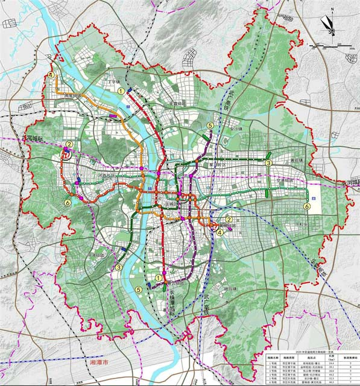
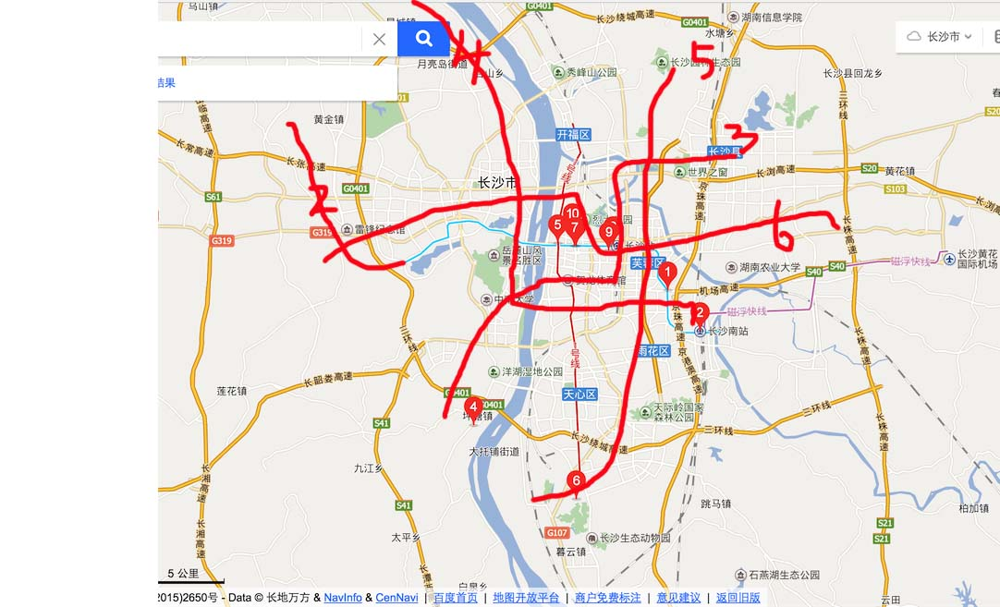

## 长沙区县多维度数据分析

### 一、人口密度 

| 区/县 | 面积(km2) | 人口(万) | 人均面积 |
| --- | --- | --- | --- |
| *芙蓉区* | 42.4 | 52.4 | 0.8091603053435115 |
| *天心区* | 141.05 | 60.46 | 2.3329474032418127 |
| *岳麓区* | 552 | 80 | 6.9 |
| *开福区* | 188 | 58 | 3.2413793103448274 |
| *雨花区* | 304.9 | 76.47 | 3.9871845168039752 |
| 长沙县 | 1756 | 89.75 | 19.565459610027855 |
| 望城区 | 956 | 57.8 | 16.539792387543255 |
| 浏阳市 | 5007 | 145 | 37.97931034482759 |
| 宁乡县 | 2906 | 144 | 20.180555555555557 |

一般来说，城市中人口密度越集中的地方应该越繁荣（辖县：长沙县、望城区、浏阳市、宁乡县不在考量范围内），由此可见，芙蓉区以及天心区属于较繁荣区

### 二、软件行业分布

>上图数据通过爬取智联长沙软件行业1787个招聘信息，分析统计得出，统计时间为2016.12.03日

其中开福区占了大头有595个职位
岳麓区：265+66(高新区属于岳麓区） = 341 紧随其后
高新区作为高新技术的规划园区，这个数据有上升趋势

### 三、交通
长沙地铁规划图（网络）

长沙地铁规划图（手绘）

网络上找到的图片较为精准，但是看起来不是很亲切，于是自己发挥了下
在地铁交通规划上，城中的芙蓉区属于网络密集区
二环以内岳麓辖区，也较为方便

