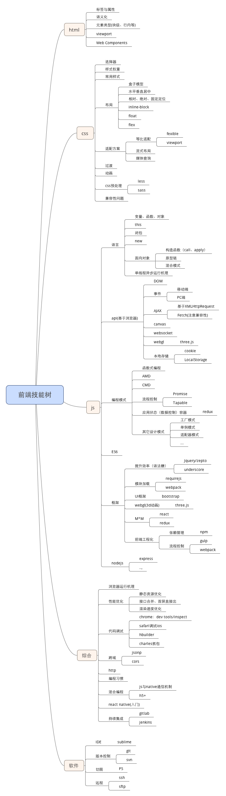

# 曾文富的个人简历
## 联系方式
- 手机：13128872736
- 邮箱：1129330609@qq.com
- 微信：facemagic2014

## 个人信息
- 曾文富/男/1989
- 本科/西南民族大学.软件工程专业.2009.09~2013.01
- 个人博客：[@小虫巨蟹](http://www.jianshu.com/u/7233332cb959)
- gitHub：[@zengwenfu](https://github.com/zengwenfu)
- npm：[@zengwenfu](https://www.npmjs.com/~zengwenfu)
- 公众号：菲麦前端
- 个人网站：[菲麦前端](http://h5.facemagic888.com/)
- 坐标：深圳
- 期望职位：高级前端工程师，架构师
- 期望薪资：面议

## 工作经历
### 一、平安金融壹账通（2015.09~至今）
> 职位：高级前端工程师，运营开发三组组长
#### F项目（银行一账通）

**项目简介**：基于标准框架，为中小银行定制专属直销银行
**项目职责**：
1） 运营活动开发：每有直销银行上线，必有获客、促活的需求，而基于h5开发的各类运营小游戏为运营活动的最佳形式。作为开发人员，从需要评审（技术选型、工作量评估、过测试用例）、开发联调、解决测试bug、以及部署上线、响应生产问题都得跟到位，作为小组组长，当有多个需求排山倒海的过来的时候，需要协调好各小组成员手头上的工作，颇具挑战性，但也获益匪浅。

由于组织架构庞大，以及采用了混合编程的形式，联调工作是最不可忽视的一环，后台接口有可能涉及多方，而混合编程框架hyperion显然也不够健壮，在没有足够权力的情况下，如何协调第三方来配合工作变得尤为关键，心得便是：友好沟通、据理力争、问题升级。

h5页面嵌入app的方式也值得思考，开始的时候跟着app一并打包，保存本地，这样做的好处是页面静态资源不依赖于网络无性能瓶颈。坏处是，更新不灵活（zip热部署的方式并不尽如人意）得跟着app的版本走、运营活动丰富的图片资源会让app变得越来越臃肿。两害相权取其轻，部署线上，专注提升页面性能方式更佳
[运营项目概览](http://120.52.138.232/showcase)

2) 理财业务开发：有一个site直销银行接手自别的团队，混合编程中“重h5”，native在其中担当的角色只是一个壳。可以说这是一个棘手的任务，接手别人的项目本已不易，况且还是充斥着大量烂代码的烂摊子。首先得去理清业务，然后再去理清代码框架，走读业务代码，画流程图，再重新开发新的业务，撸起袖子就得干。

新的技术框架中引入了react native，有幸参与开发了几个RN页面，基本算是入门，后调投入到别的h5需求上，尚未深入，有机会还得继续探索

3) 前端工程搭建：入职时沿袭了前人的框架，基于gulp构建的工程，灵活轻便，不完善之处修修补补不亦乐乎。然而webpack以迅雷不及掩耳之势盗铃之势走红的时候，深感起一切皆模块之妙，而我们原框架组建建设之匮乏。包括我组技术头的几个技术骨干将进行新的工程建设，彼时，react、vue等框架风头正盛气，市场上也充斥着各类ui框架，要不要选其一？答案是否定的，运营游戏界面风格丰富，不应当加上重武器的枷锁。

这其中我们的多页面应用框架遇到了一个问题，市面上竟然还没有合适的插件可以处理多页面html模板的webpack插件，埋头苦读webpack源码，自己写了一个：
[muti-html-webpack-plugin](https://github.com/zengwenfu/muti-html-webpack-plugin)

#### 业务生成平台
**项目简介**：可视化配置工具，自动生成部分业务逻辑代码
**项目职责**：
随着运营活动的深入，我们发现，很多流程细节可以原子化封装，例如登录态判断、活动是否过期判断、开户绑卡判断，每个运营活动流程各异，但无不由这些原子化操作拼接成。将这些原子化模块写成模板，做一个可视化平台进行可视化的配置拼接，再根据模板渲染生成运营活动的部分js代码（界面样式灵活，css无法生成）

通过三个人的谋划和开发，平台终于做成，极大的提高了工作效率，并且让水平参差不齐的开发人员得以做到一致的代码风格，根据统计，生成的公共代码部分占比常常达到60%
[业务生成平台由此去](http://blp.pinganh5.com/public/login.html)

#### 运营活动场景动画生成工具
**项目简介**：可视化拖拽生成场景动画
**项目职责**：
起初这个需求交到手上的时候，只是做一个场景动画页面，这种“很易企秀”的需求寻思着应该会很多，为了不再被需求人员烦，何不做一个精简版的易企秀？说干就干，从实例到模板再平台化：[从零打造在线版H5页面生成器](http://www.jianshu.com/p/00681bc68caf)

然而此类业务需求我们并不会很多，投入产出比不可观，所以原先预计从组内人员中投入的人力也木有了，也不会有排期上的照顾，本着不抛弃不放弃的精神，投入大量业余时间，终于还是做出一个基本可用的平台工具出来：[场景生成工具](http://dweb.pinganh5.com/home)

#### 部门h5前端技术周报
**项目简介**：汇聚部门原创文章，全网收集前端好文，每两周一期
**项目职责**：不多说，直接看吧，[周报](http://www.jianshu.com/nb/8259927)

### 二、北京蓝泰致铭管理咨询有限公司（深圳，2014.03~2015.09）
> 职位：前端工程师、必要的时候也承担java接口开发

#### 知学云
**项目简介**：企业学习培训、人才发展、知识管理和社交工具
**工作职责**：
1）承担app中跨平台的h5部分的开发：例如考试模块的考试页面，用户可以考试的过程中中途退出，而后重新进入，这涉及到两个问题：其一，试题信息没有必要请求两次，所以需要本地缓存，其二，需要保存用户上一次做题的现场，进入到相同的位置。

在设备适配方面采用的是流式布局，结合media query响应式布局的方式（当时年少不曾触及viewport和flexible的等比适配方案啊）。兼容性问题上也没少踩坑，点击穿透，fixed等等，积累了不少经验

2）必要的时候也做一些java接口开发：java开发经验也没白费，支援jFinal数据接口开发也是杠杠的

#### h5+app实验性项目
**项目简介**：
调用dcloud推出的h5+混合编程框架，开发一个简化版知学云demo，主要用于技术调研

**项目职责**：
demo做出来了，不过并未投入真实项目中，而是自己实现了一套js和native的通信方案，因为h5+对于我们来说功能太多太重了

#### app托管平台
**项目简介**：将应用上传到平台，可以通过二维码安装，仿蒲公英
**项目职责**：承担其中的界面开发，以及后台Java开发（然而，开发完成前离职交接出去了） 

### 三、成都中联信通科技股份有限公司（2013.03 - 2014/03）
> 职位：软件工程师，主做java，当然充斥着大量的js编写工作

#### 卡包系统（IMPP）
**项目简介**：银行卡、预付卡、优惠卡的虚拟卡包
**项目职责**：为app提供数据接口，同时维护开发采用extjs开发的管理后台

#### 银联支付通道（UPMP）
**项目简介**：银联支付通道接入服务
**项目职责**：需求评审、功能开发

#### 资金归集
**项目简介**：归集各级商户代理商的资金，以及提成计算
**项目职责**：app数据接口开发，extjs管理后台开发

### 四、北京云洪道元信息技术有限公司（2012.09 - 2013.01）
> 职位：j2ee实习生

参与“中国移动12530门户网站”的项目中，实习生嘛，所做之事无足挂齿，然而学校中所有j2ee的学习，在此得到强化

## 开源项目和作品
### 开源项目
1) **webpack html 多页面插件**
[传送门](https://github.com/zengwenfu/muti-html-webpack-plugin)
2) **基于代理服务的接口合并方案node实现（freedom-api）**
[传送门](https://github.com/zengwenfu/freedom-api)
3) **webpack nunjucks loader**
之前npm上搜索到一个loader，使用报错，读它源码发现只适用于后台的，无奈自己写了一个：[传送门](https://github.com/zengwenfu/compile-nunjucks-loader)
4) **node + react + redux + express服务器端渲染脚手架搭建**
[传送门](https://github.com/zengwenfu/facemagic)
5) **node爬虫案例**
[传送门](https://github.com/zengwenfu/jian-analyse)
### 作品
1) [从零打造在线版H5页面生成器](http://www.jianshu.com/p/00681bc68caf)
2) [webpack不适合多页面应用？你写的插件还不够多](http://www.jianshu.com/p/f6a2a47d084d)
3) [基于代理服务的接口合并方案](http://www.jianshu.com/p/07293e4825d0)
4) [前端性能优化的三个维度](http://www.jianshu.com/p/a5d9938ed60f)
5) [买了阿里云之后](http://www.jianshu.com/p/fc6262a7466e)
6) [js运行机制深层剖析](http://www.jianshu.com/p/0983e69d58ec)

## 专业技能图谱
> 走心的给自己的专业技能画一个图谱

