# 厦门2日游攻略

## 景点介绍
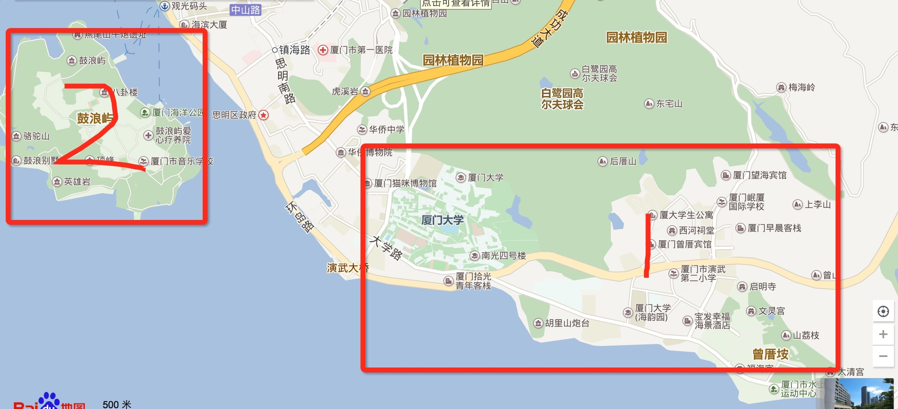
上图两日游的目的片区，包含：

### 一、鼓浪屿
1. 日光岩: 日光岩俗称"岩仔山"，别名"晃岩"，相传1641年，郑成功来到晃岩，看到这里的景色胜过日本的日光山，便把"晃"字拆开，称之为"日光岩"。日光岩游览区由日光岩和琴园两个部分组成。日光岩耸峙于鼓浪屿中部偏南，是由两块巨石一竖一横相倚而立，成为龙头山的顶峰，海拔92.7米，为鼓浪屿最高峰。游人登临，看云天近在咫尺，凭栏放眼，纵目远眺，厦门岛外大担、二担，大小金门等岛尽收眼帘
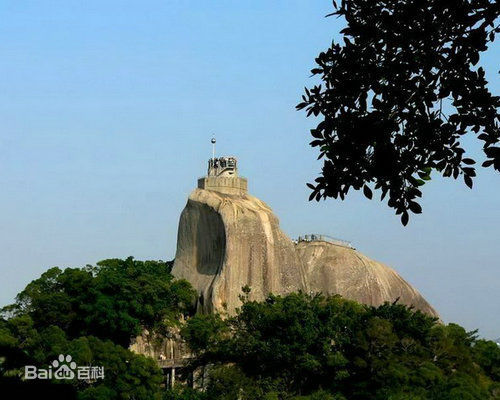
2. 淑庄花园：菽庄花园建于1913年，位于鼓浪屿岛南部，面向大海，背倚日光岩。原是地方名绅林尔嘉的私人别墅，园主人以他的字“叔臧”的谐音命名花园，1955年献作公园。 菽庄花园利用天然地形巧妙布局，全园分为藏海园和补山园两大部分，各景错落有序，园在海上，海在园中，既有江南庭院的精巧雅致，又有海鸥飞翔的雄浑壮观，动静对比，相得益彰。
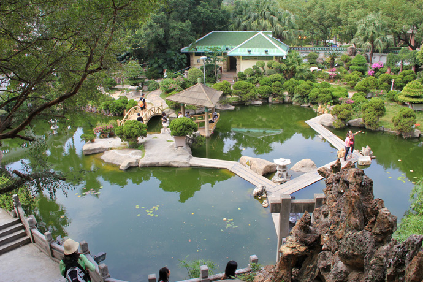
3. 风琴博物馆：风琴博物馆坐落于八卦楼里，场馆不是很大，展示了5000余台，各种年代，各式的风琴，对音乐感兴趣的不妨来逛逛，不然可能会觉得无趣。 据说是目前我国惟一、世界最大的风琴博物馆。 场馆一楼展览了许多有历史的世界各地的风琴，大部分都是产之法国和西班牙。这里的镇馆之宝是世界上最大的一架风琴。博物馆的后园摆放着一些从海关缴获的走私文物，都是一些石雕。
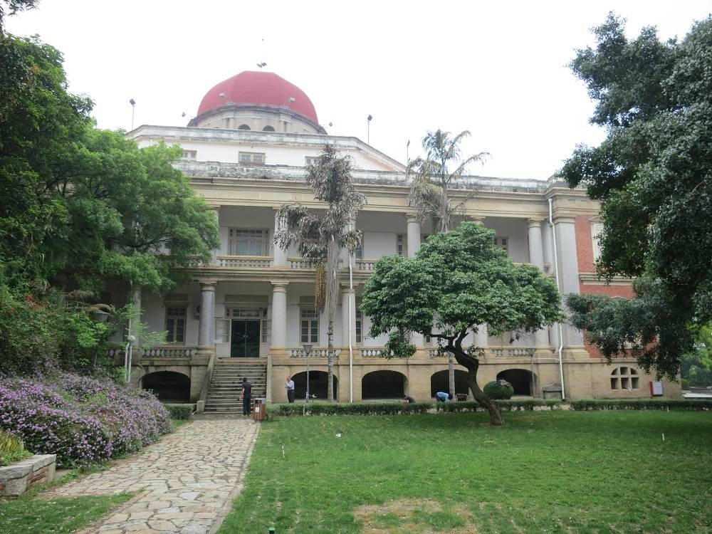
4. 皓月园是纪念民族英雄郑成功的雕像园，这里明代风格的建筑与海景山色相辉映。郑成功的巨型花岗岩雕像矗立在覆鼎岩上，与海中的剑石、印斗石鼎足而立。 皓月园是为了纪念郑成功驱逐荷夷，收复台湾的历史功绩而建立。园中广场竖立着被誉为厦门最美的大型群雕《藤牌驱虏》，生动地再现当年郑成功统率千军万马，挥师宝岛台湾驱荷复台的壮观场面。 还有以郑成功为主题内容的南碑廊、北碑廊等都以不同形式，不同角度，再现郑成功叱咤风云英雄气概。，其名取自郑成功的诗句“思君寝不寐，皓月透素帏”中的“皓月”二字，寄托对英雄的缅怀和对台湾同胞的思念。
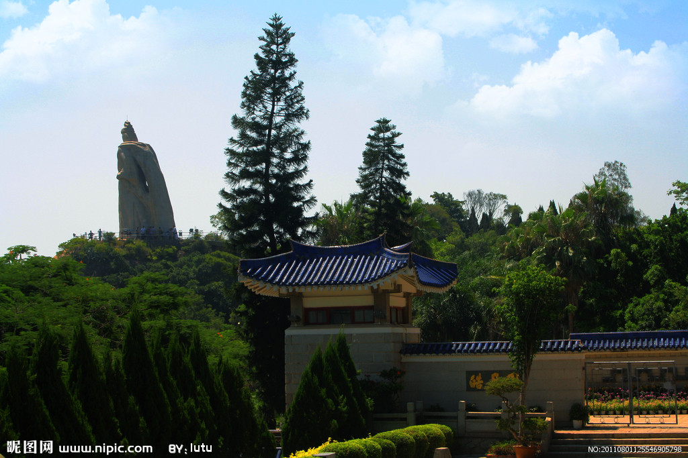
5. 百鸟园位于鼓浪屿的琴园里，园内不大，有流水、假山、小道等风光。里面引进了来自世界各地的近百种珍贵鸟类，可以看见孔雀悠闲的在散步，还有驯鸟表演可看。 园中有珍禽寨、孔雀台、攀禽林、涉禽池、表演园等园中园景点，它们都是按照鸟类的生态群类兴建的；双桥之间还有迭水瀑布倾泻而下，鸟语花香、小桥流水，是人们休闲娱乐的好去处。 在9:30、10:30、11:30、14:00、15:00、16:00有鸟艺表演，如果你带了孩子，鹦鹉滑梯、推车等表演都会让他们感到很开心。
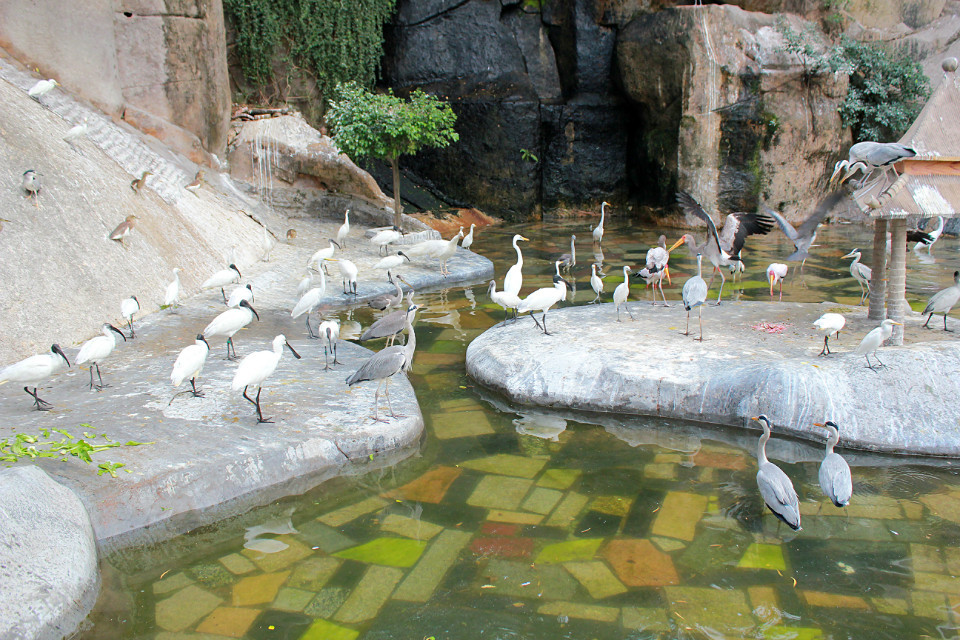

### 二、环岛路
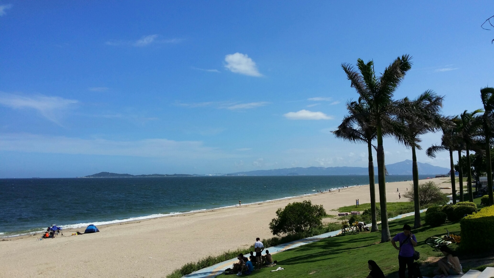
环岛路是厦门国际马拉松比赛的主赛道，被誉为世界最美的马拉松赛道。绕着环岛路骑自行车，聆听海浪，轻拂海风，真的是一种享受。环岛路的东南段有环岛木栈道，使之前很多游人无法到达的海边礁石地段都可以通过木栈道一览美景；另外，木栈道沿线还将设置音乐酒吧、观景亭、LED夜景等景观工程，开拓游人视野，使木栈道成为环岛路的一道新景。附近的椰风寨和胡里山炮台都是不错的去处。
> 可以选择步行木栈桥再骑行一段，累了就坐巴士，大概耗时2小时

### 三、胡里山炮台
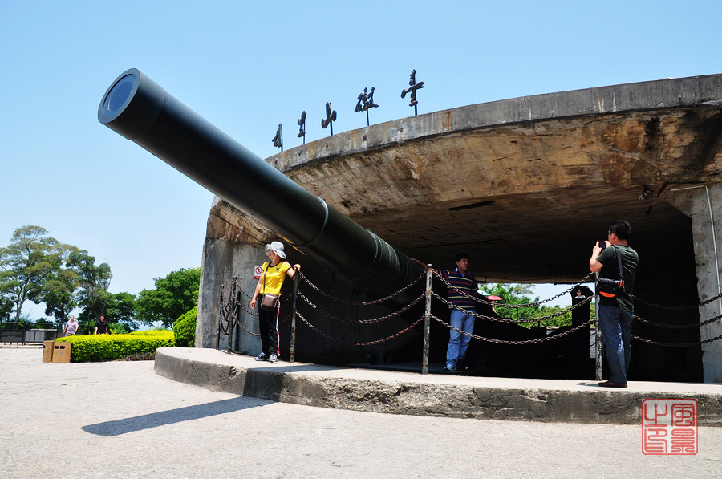
胡里山炮台靠近厦门大学，是中国洋务运动的产物。始建于清光绪二十年（公元1894年）。炮台总面积7万多平方米，城堡面积1.3万多平方米，分为战坪区、兵营区和后山区，内开砌暗道，筑造护墙、弹药库、兵房、官厅、山顶了望厅等。炮台结构为半地堡式、半城垣式，具有欧洲和我国明清时期的建筑风格。

### 四、厦门大学
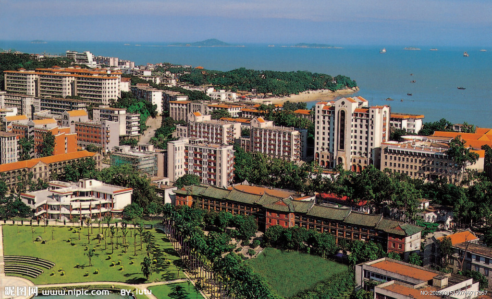
这是座很美的校园，校园内绿树成荫，无论漫步还是在树下看书感觉都很惬意。鲁迅先生曾在这长时间工作，所以园内建有唯一一座在高校内的鲁迅纪念馆。学校周边更是咖啡馆林立，小资氛围十足。 厦门大学是由著名爱国华侨领袖陈嘉庚先生于1921年创办的，是中国近代教育史上第一所华侨创办的大学。其的旧建筑多为陈嘉庚先生的女婿所建，尤其是建南大礼堂和上弦场，相当宏伟。 必去的地方有芙蓉湖（南门进了厦大就是一排高高的楼群，最高的那栋主楼前面就是芙蓉湖，厦大就是绕着芙蓉湖建的），情人谷，上弦场，芙蓉隧道等等，最后还可以从白城小门（也叫北门）出去，到白城海滩逛逛。

### 五、南普陀寺
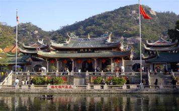
南普陀寺是闽南乃至全国闻名的佛教寺院。整个寺庙建筑群背依秀奇群峰，著名的闽南佛学院就坐落于此，与厦门大学仅一墙之隔，却有两种意境："古朴与摩登并存，小和尚和大学生为邻"。南普陀寺建于明代永乐年间(1403—1424年)，明末(1628年)毁于兵火。清康熙二十三年(1684年)，靖海侯施琅将军重建。因寺院是奉观音菩萨主，又位在我国四大佛教道场之一的浙江舟山普陀山之南，故称南普陀寺。

### 六、曾厝垵
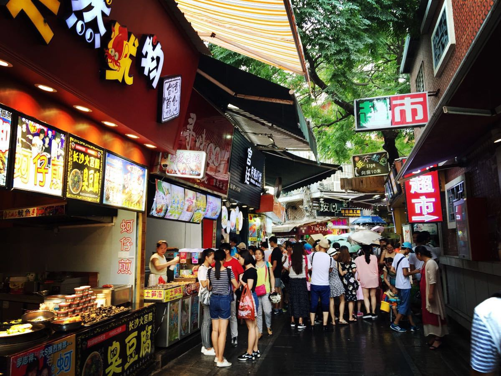
曾厝垵就是“曾村”的意思，曾是坐落在环岛路旁的一个原始小渔村，近年来却成为厦门又一文艺小清新们的聚集地，尤其是夏季，会有全国各地的文艺青年蜂拥而至。
这里有很多有情调的咖啡厅、餐厅和特色商品小店等；还融汇了道教、佛教、基督教、伊斯兰教，更有厦门独有的，香火旺盛的妈祖崇拜。

## 预算（2000）
1. 交通类 970
```
    //高铁
    150*2*2 = 600；
    //出租 从高铁站到旅馆
    100*2 = 200；
    //鼓浪屿船只
    35*2*2 = 140；
    //公交1到2元不等  没人估计坐十趟公交  
    1.5*10*2 = 30;

    总：970
```
2. 住宿 200
```
    //红磨坊有67~148的房子，我们大概住个100的差不多
    100*2 = 200
```
3. 门票 200
```
    //鼓浪屿套票
    //可以玩的地方：日光岩（60）、百鸟园、菽庄花园（30）、皓月园（25）、风琴博物馆
    100*2 = 200
```
4. 吃 200

> 总：1570 + 其它 约等于 2000

## 出行准备
去之前注意查询天气，准备好衣物即可

## 住宿
大锤介绍了一个旅馆，环境不错，离玩的地方也方便，据说老板娘人还很好，已加微信，因为介绍所以有优惠，[旅馆照片看这里](http://hotel.elong.com/xiamen/11401036/)

## 行程安排
### 一、第一天（周五）
1. 周五请半天假，中午出发，下午到厦门，从高铁站打的士到曾厝按安顿下来
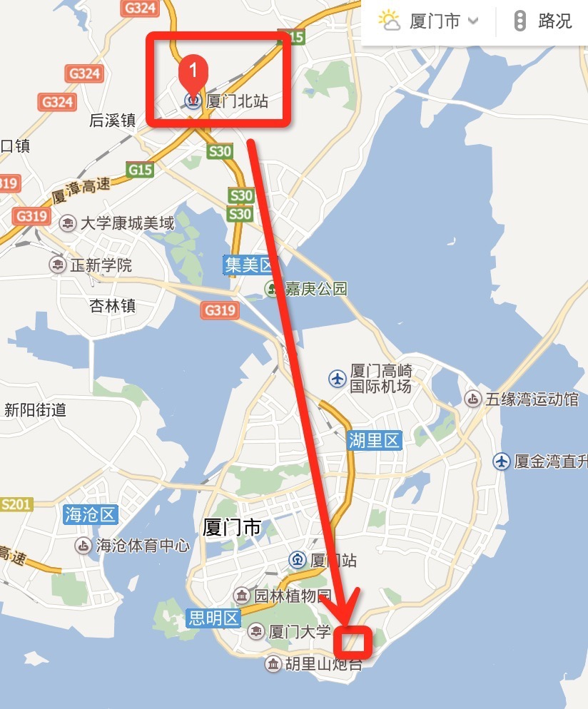
2. 晚上在**曾厝按**逛街吃小吃、买东西

### 二、第二天（周六）
1. 周六从`曾厝垵`坐329路到`第一码头`站下车，坐厦鼓内厝澳居民轮渡从`第一码头`到`鼓浪屿内厝澳码头`站
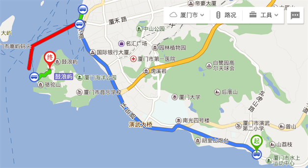
2. 鼓浪屿游玩一天
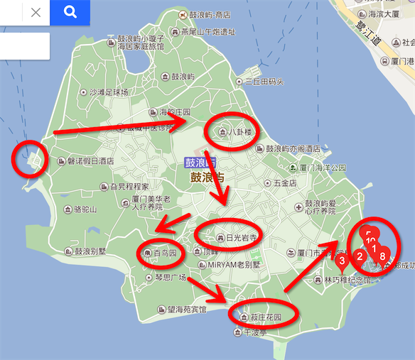
图中箭头路线
```
    码头->风琴博物馆->日光岩->百鸟园->淑庄花园->皓月园
```
3. 返程
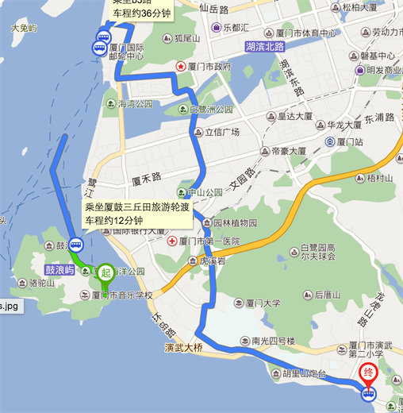
```
    皓月园->三丘码头 //步行
    三丘码头------->东渡邮轮中心码头 //游轮
    游轮中心码头--->曾厝垵 //公交
```

### 第三天（周日）
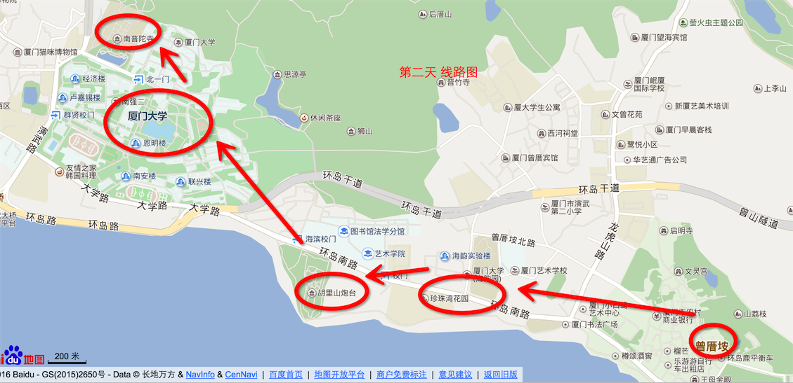
1. 6点起床，墨迹一下吃个早餐7点  7：00
2. 环岛路：步行木栈桥，骑行一段（大约2小时） 9：00
3. 胡里山炮台观景（1小时）10：00
4. 厦门大学（2小时）12：00
5. 12点吃个中午饭1点 13：00
6. 南普陀寺（2个小时）15：00
7. 坐29路车30分钟回到住处，收拾行李准备回家 16点
8. 打的士到高铁站 17：00
9. 等17：56的高铁回家

## 吃
1. 姜母鸭
2. 炒面线
3. 花生汤
4. 海蛎煎
5. 南普陀素菜
6. 同安村肉
7. 浮屿大同鸭肉粥
8. 叶氏麻糍粑
9. 潘小莲酸奶
10. 小眼境大排档


