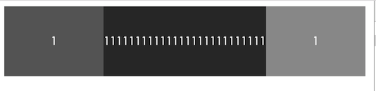

# 前端碎片

## 1. npm run command 不完全等于直接在命令行输入command
```
    "scripts": {
        "start": "cross-env NODE_ENV=dev supervisor -w server,app.js app",
        "bs": "cross-env NODE_ENV=dev node app_browsersync",
        "build": "webpack --config webpack.production.config.js -p",
        "precommit": "eslint 'client/js/**/*.js'",
        "production": "gulp webpack",
        "public": "node app_public.js"
      }
```

> 在命令行输入npm run public 和直接输入node app_public.js都不会有问题，然而执行node run start正确的情况下，执行cross-env NODE_ENV=dev supervisor -w server,app.js app却会报错。原因是，npm run 能将 /node_modules/.bin 加到你的PATH中，gulp进行了全局安装所以public命令不管怎么执行都是可以的，然而coss-env和supervisor都未进行全局安装，直接在命令行执行是找不到命令的，而使用npm run, 在/node_modules/.bin 目录下找到了命令，所以可以正常的跑

## 2. 点击穿透的成因
> 事件的触发顺序 touchstart-->touchmove-->touchend，之后约等待300ms没有双击的行为触发click，为了增强用户体验，很多经典的框架新增了tap事件的封装（如zepto），在touchend触发后一个较短的时间内（大概250ms）触发tap。
> 然后再来看看点击穿透的场景，就很容易看懂了，再点击蒙层的时候，我们监听了tap让蒙层消失，当到时间触发click的时候，再点击的位置就剩下蒙层背后的输入框了，给人以点击穿透的感觉，在tap的时候阻止后续的click就可以解决
> 同样的原理还会在另外一个地方带来问题，页面上有很多input，点击一个input软键盘启动，点击页面空白处，关闭软键盘，但是事与愿违，软键盘关闭之后又被重新打开。


## 3. flex布局不可以忽视的子元素的原始宽度
```
    //css代码
    .box{
      display: -webkit-flex; /* Safari */
      display: flex;
    }

    .item {
        flex: 1;
        text-align: center;
        color: #FFFFFF;
        height: 100px;
        line-height: 100px;
    }

    .first {
        background-color: #666666;
    }

    .second {
        background-color: #333333;
    }

    .third {
        background-color: #999999;
    }

    //html代码
    <div class="box">
        <div class="item first">1</div>
        <div class="item second">11111111111111111111111111</div>
        <div class="item third">1</div>
    </div>
```

> 初尝试flex布局经常绕不过一个坑，为什么明明item的flex都等于1，然而三个item确不等宽？
> 其实flex项目伸缩的量是基于”父容器的宽度 - 子元素原始宽度的总和“，上例中，子元素平均分配了可分配的量，加上不相等的基量之后，自然宽度就不一样了。把item的width设置为0，三个item就等宽了

## 4.webpack loader需要放到node-modules下
> 写一个webpack loader并不复杂，按照官方教程来就可以了，但是写好了之后，使用并没有这么自由，不是任意放一个目录，webpack都能准确找到的，只能放到项目的node-modules下。然而node-modules一般都是要脱离版本管理的，这就不便于移植了，于是最好的办法就是上传到npm，通过npm install --save-dev来管理
