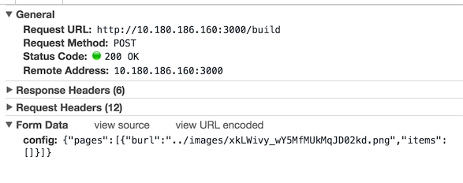

# web表单中的enctype是什么鬼
> 一旦项目中需要文件上传，你就能很熟练的在表单上增加`enctype="multipart/form-data"`属性,然而你是否思考过为什么需要这样做呢？

## HTTP POST 数据传输
HTTP协议建立在TCP/IP协议之上的应用层规范，规范定义请求分为：状态行、请求头、消息主体，用chrome dev tool可以看到：


其中General对应于状态行，request Headers对应于请求头，formData对应于请求主体（还有可能是payload）
> 这是chrome dev tool 解析的结果，实际传输中并不是如此

对于post请求，协议要求数据必须放到消息主体中进行传输（有别于get请求将数据附在url之后，即放入协议头中传输），那么问题来了，消息主体中的数据以什么数据格式传输呢？这就要发挥enctype的声明作用了

## Content-Type & enctype
如果你足够细心，你会发现请求头中有一个Content-type字段


这个字段声明了消息主体中数据的编码方式，`application/x-www-form-urlencoded;charset=utf-8`表明提交的数据按照`key1=val1&key2=val2`格式编码，例如：
```
    title=test&sub%5B%5D=1&sub%5B%5D=2&sub%5B%5D=3
```
后台收到请求，就可以根据请求头中的Content-Type来对请求数据解码
> 这一步往往对开发者来说是透明的，那是因为一般的服务器框架都把这事做了，是不是有get-新技能了~~

然而，这跟enctype有什么关系呢？
**在表单中设置enctype属性，也就指定了请求头中Content-type的值，默认不设置enctype的情况下，Content-type为application/x-www-form-urlencoded;charset=utf-8**

回到题引，文件上传的时候，我们会在表单中设置`enctype="multipart/form-data"`，此时请求信息大概为：
``` 
    //请求头
    //Content-Type除了指定编码形式为multipart/form-data
    //还指定了此处的分隔符（boundary）
    Content-Type:multipart/form-data; boundary=----WebKitFormBoundaryER0jqXh3Qttw3ldU
```

```
    //请求体
    ------WebKitFormBoundaryER0jqXh3Qttw3ldU
    Content-Disposition: form-data; name="file"; filename="箭头向上.png"
    Content-Type: image/png

    //此处是文件二进制内容
    
    ------WebKitFormBoundaryER0jqXh3Qttw3ldU--
```
由于涉及到文件，内容比较大，使用`application/x-www-form-urlencoded;charset=utf-8`的方式来分割就不尽如人意了，采取一个分割串的形式来分割还是比较合适的，请求头中定义了分割串，请求体中每个参数都被夹在分隔符之间（--boundary开始，--boundary--结束）

另外常用的enctype还有`application/json`和`text/xml`，顾名思义，分别是json和xml的传输格式，这里就不细说了

## 总结
虽然不知道这些也不影响coding，但是揭开面纱还是很有意义的
欢迎留言讨论，如果对您有帮助，请留个赞~~

