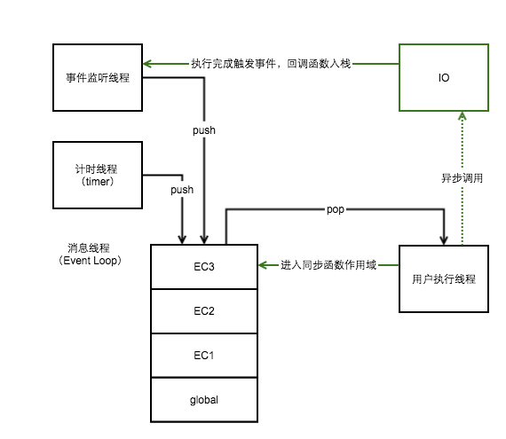

# js运行机制深层剖析
> ”js是一门单线程的语言，js最大的特性是异步“，这些说法已经见惯不怪了，然而不了解js的解释执行始末，这些概念也就只是听听，真正遇到问题的时候，也只能一脸懵逼而已~

## 一、Event Loop 机制/异步原理


由于js是一门单线程的语言，为了实现异步特性，必须有一种行之有效的机制，Event Loop就是这种机制
> 说js是一门单线程语言，指的是它只有一个用户执行线程，同一时刻只能执行一个任务，在你看不见的地方，还需要有很多其它线程/进程来调度

### 同步的情况
当程序开始运行的时候，将默认执行**全局执行上下文**（将在后文中说明）中的代码，如果遇到同步函数，那么将把当前**执行上下文**压入栈中，进入同步函数的**执行上下文**执行（倘若在函数中又遇到了其它同步函数，将持续此过程），当函数执行完成，执行线程将从消息线程中pop一个**执行上下文**进行执行
```
    global() {

        /**
         *  定义
         */
        EC3() {

        }
        EC2() {
            EC3(); //调用EC3
        }
        EC1() {
            EC2();//调用EC2
        }

        //调用EC1
        EC1();
    }
```

### 异步的情况
如果当前**执行上下文**遇到了异步操作，那么它向事件监听线程或者计时线程发出通知之后，将继续执行，此时有两种情况：
a) 计时函数，如:
```
    setTimeout(func, 1000);
```
此时，异步通知将发给计时线程（timer），一秒后，计时线程将会把`func`函数的执行上下文压入消息线程堆栈，执行线程在处理完当前**执行上下文**的时候从消息线程堆栈中pop出func的**执行上下文**进行执行（如果在此期间没有别的**执行上下文**入栈的话）
> 所以，`setTime(func, n);`并不能保证，在n毫秒之后func能被执行，这还得看执行线程当前在干什么了

b) 事件监听线程，如果发起的是一个异步io操作，如发起一个网络请求：
```
    $.ajax(url, params, callback);
```
那么异步事件将发给事件监听线程去监听，一旦网络请求完成，同样的，事件监听线程将把callback的执行上下文入栈，等待执行线程的召唤


## 二、js的执行上下文
> 上文反复提到执行上下文，下面就对执行上下文进行一个深入剖析

### 如何理解执行上下文
所谓执行上下文，就是js执行的时候的一个运行环境/作用域（scope），有如下几种情况：
1. 全局执行上下文/作用域：js代码的默认执行环境（只有一个）
2. 函数执行上下文/作用域：每个函数对应的执行环境（无限多个）
3. eval代码执行上下文：使用eval执行的脚步的执行环境
```
/**
 * 全局执行上下文/作用域
 */
        console.log('在全局环境中执行')

        function hello() {  //hello函数执行上下文/作用域
            var say = 'hello';

            function world() { //world函数执行上下文
                ...
            }
        }

```

全局作用域中的方法、变量，可以被其它任何函数作用域所访问，函数作用域中的方法变量，在子函数作用域中可以访问，外部无法直接访问
> 通过函数返回的子函数去访问函数作用域的私有变量，也就形成了闭包

### 执行堆栈
也就是上文提到的Event Loop，该线程以**栈**的形式保存执行上下文，函数执行上下文的入栈出栈的过程，使得js得以在单线程的情况下，实现异步特性


### 执行上下文的创建与执行
每一次函数被调用，js解释器都会为之创建新的上下文，此时可以分为两个阶段：
a) 上下文的创建阶段：函数被调用，但尚未开始执行（代码分析预处理阶段），此时会为执行上下文创建作用域链，创建变量、函数和参数以及求this的值
```
    executionContextObj = {
        scopeChain: { /* 变量对象（variableObject）+ 所有父执行上下文的变量对象*/ }, 
        variableObject: { /*函数 arguments/参数，内部变量和函数声明 */ }, 
        this: {} 
    }
```
> 特别的，变量提升就是在这个阶段发生的

b) 执行阶段：指派变量的值和函数的引用并解释执行代码

下面再用伪代码的形式来描述一下这个过程：
```
    //函数被调用
    1. 创建执行上下文
        a) 创建作用域链
        b) 创建变量、函数和参数
        c) 求this值
    2. 开始执行在执行上下文上 执行
        ...
        a) 遇到同步函数
        b) 当前执行上下文入栈
        c) 重复以上过程
        ...
    3. 执行完成，往上一层 执行上下文  返回数据
    4. 从执行上下文栈pop出一个新的执行上下文执行
```

## 二、总结
了解js解释器一些底层原理，是非常有必要的，当程序的运行结果跟你的预期结果不一样的时候，甚至看起来很诡异的时候，如何去解释，就很体现能力了

如果对您有帮助，请点个赞，更多精彩，欢迎关注公众号


