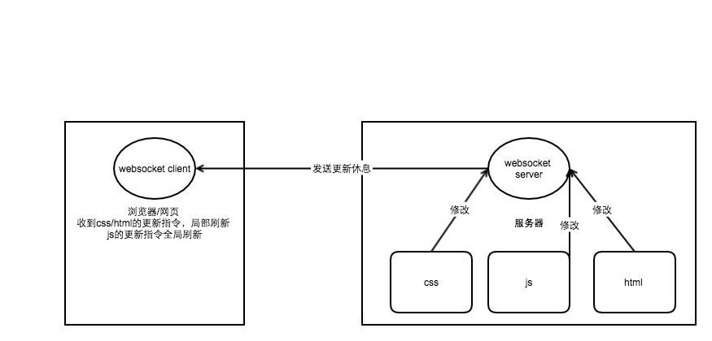
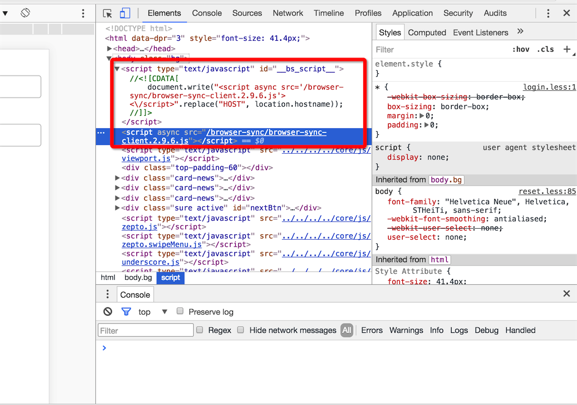
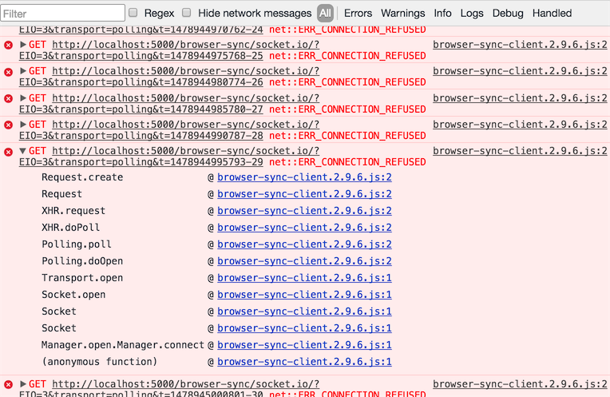

# 前端开发热更新原理解读
> 猿类的创造力的原始动力多来源于**偷懒**
> 前端的同学们在搭建自己的开发环境的时候，为了避免手动刷新浏览器的繁复，使用起了热更新工具
> browserSync 和 webpack-dev-server是其中的代表作品

<h2>目录</h2>
- <a href="#1">一、websocket简介</a>
- <a href="#2">二、热跟新原理</a>
- <a href="#3">三、实例剖析</a>
- <a href="#4">四、总结</a>

<h2 id='1'>websocket简介</h2>
在h5推出之前，浏览器应用跟服务器端通信的机制只有http协议，http是一种无状态的网络协议，前端向服务器发起一个请求，服务器给出一次应答，服务器无法主动向客户端发起通信，这种设计主要是为了节省带宽资源，客户端和服务器端不需要维持长连接

早期要实现一个浏览器即使通信工具（如webqq），由于服务器端不能主动向客户端发起通信，只能客户端设置一个定时器，定时向服务器端发起请求拉取消息，很显然，这种轮询的方式对性能来说是一把杀猪刀

h5很应景的推出了websocket，这给了web开发者另一种选择去应付纷繁复杂的场景。WebSocket 是一个独立的基于TCP的协议，前端和服务器端可以建立起一个长连接，客户端可以向服务器端推送消息，服务器也可以主动向客户端推送消息
> 本文不对websocket做太深入的说明，有兴趣可留下你的评论

<h2 id='2'>热跟新原理</h2>


浏览器的网页通过websocket协议与服务器建立起一个长连接，当服务器的css/js/html进行了修改的时候，服务器会向前端发送一个更新的消息，如果是css或者html发生了改变，网页执行js直接操作dom，局部刷新，如果是js发生了改变，只好刷新整个页面
> js发生改变的时候，不太可能判断出对dom的局部影响，只能全局刷新
> 为何没有提到图片的更新，如果是在html或者css里修改了图片路径，那么更新html和css，只要图片路径没有错，那么就已经达到了更新图片的路径。如果是相同路径的图片进行了替换，这往往需要重启下服务

在简单的网页应用中，这一个过程可能仅仅是节省了手动刷新浏览器的繁琐，但是在负责的应用中，如果你在调试的部分需要从页面入口操作好几步才到达，例如：`登录->列表->详情->弹出窗口`，那么局部刷新将大大提高调试效率

<h2 id='3'>实例剖析</h2>
如果你使用gulp构建的前端开发工作环境，想必对browserSync不会陌生，你明白它的工作方式么？

browserSync易于使用
```
    var bs = browserSync({
        port: 5000, //服务端口
        notify: false,
        logPrefix: 'PSK',
        
        server: {
            baseDir: '_dev', //服务路径，也就是页面资源存放的路径
            directory: true
        },
        open: false //需不需要自动打开浏览器
    }, function() {
        //启动后的回调
    });
```
很容易想到，这开启了一个http服务，在浏览器输入localhost:5000/path就可以访问到页面，不知道有没有细心的观众在查看页面源码的时候发现多了点什么不是你写的东西

没错，browser-sync-client.2.9.6.js并不是你引入的，这个是browserSync在创建的时候，为你的html自动注入的（baseDir目录下），部分代码：
```
    .........
    ___browserSync___.io = window.io;
    window.io = window.___browserSync___oldSocketIo;
    window.___browserSync___oldSocketIo=undefined;
    ___browserSync___.socketConfig = {"reconnectionAttempts":50,"path":"/browser-sync/socket.io"};
    ___browserSync___.socket = ___browserSync___.io('' + location.host + '/browser-sync', ___browserSync___.socketConfig);
    "use strict";
    (function (window, document, bs, undefined) {
        var socket = bs.socket;

        var uiOptions = {
            bs: {}
        };
    ..........
```
原谅我，我并未仔细研读过次文件代码，因为实在太多太凌乱，但是从上面这几行代码，以及文件名，就基本可以确定这是websocket-client的代码
> 读过的同学求抱大腿

下面再来做一个实验来确认下，control+c 把服务器关闭，再来看看刚才那网页的控制台：

控制台一直在报错，why? 因为服务器关闭了之后，连接断开，客户端一直在尝试对服务器发起重连

再来看看webpack是怎么做的，webpack可以使用webpack-dev-server来搭建热跟新的开发环境，webpack-dev-server是基于express的轻量级服务器，作用有点类似于上述的browserSync，你需要在webpack.config.js中的entry配置里增加的点东西
```
    var config = {
      entry: ['webpack/hot/dev-server', './app/main.js'], 
      output: {
        path: path.resolve(__dirname, './build'),
        filename: 'bundle.js'
      },
      module: {
        loaders: [{
          test: /\.js$/,

          // Use the property "loaders" instead of "loader" and 
          // add "react-hot" in front of your existing "jsx" loader
          // 使用 "loaders" 属性代替 "loader"
          // 然后在 "jsx" 加载器之前添加 "react-hot" 
          loaders: ['react-hot', 'babel']
        }]
      }
    };

```
配置中增加了webpack/hot/dev-server实体，跟main.js一起打包成bundle.js，这个就可以类比到上面的browser-sync-client.2.9.6.js
> 如果自己搭建express，还可以使用webpack的热跟新中间件

<h2 id='4'>总结</h2>
知其然并知其所以然是很重要的，不要求搞清楚每一个细节，但要懂得实现原理


