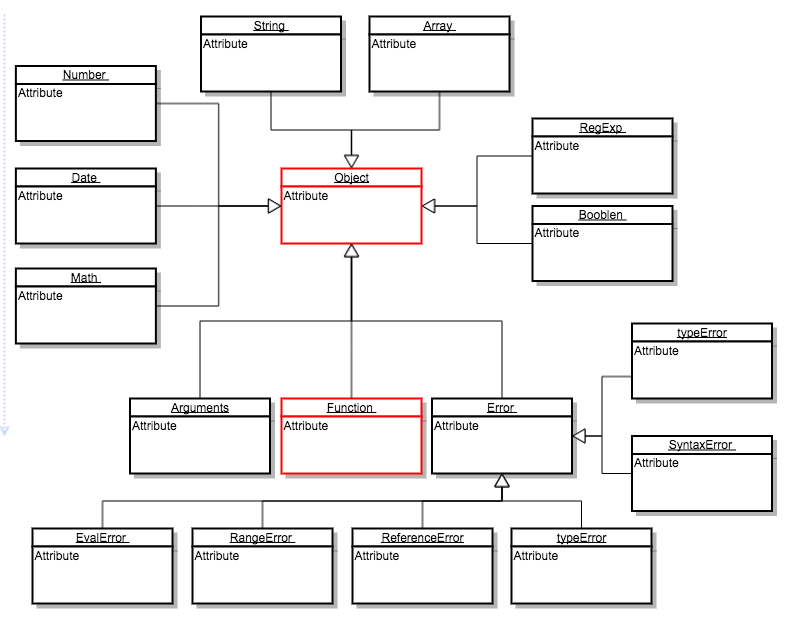
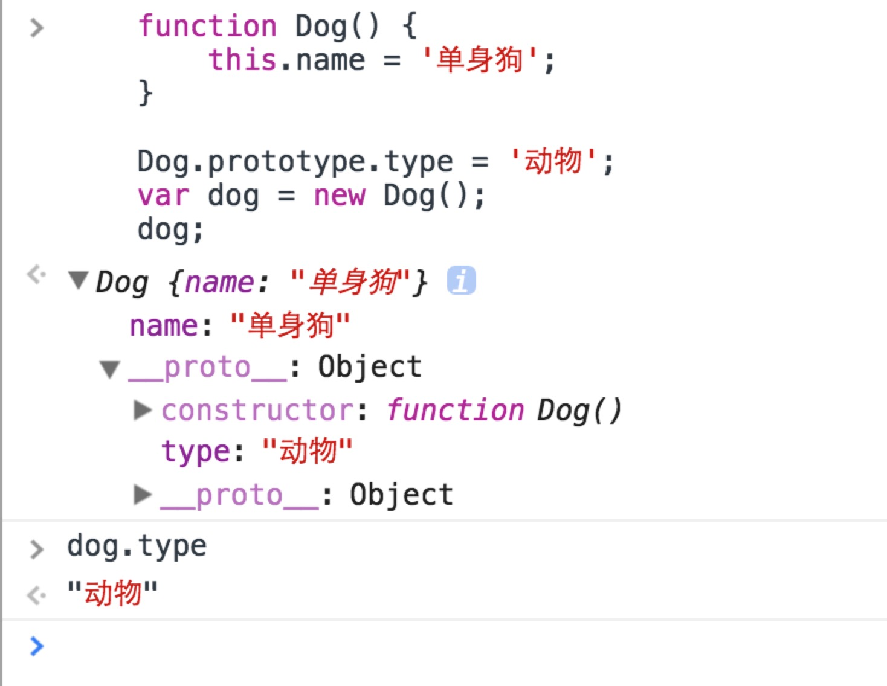
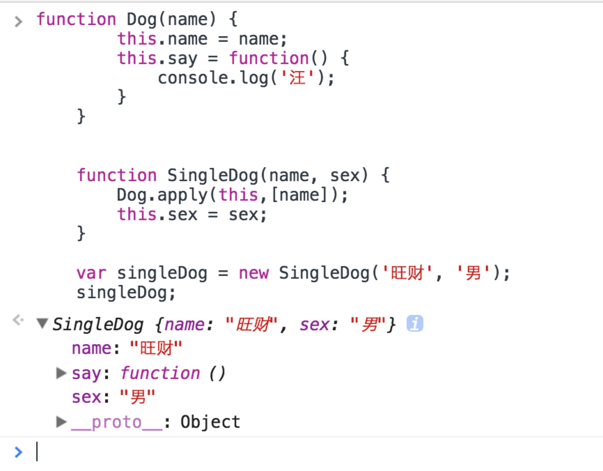
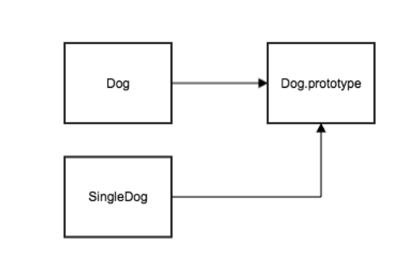

# 换一种姿势理解js中的面向对象
> 在传统的面向对象语言中，类是最基础的概念之一，然而在es6之前，js是没有类的，但它却又面向对象，这就是本文要讨论的内容

## 面向对象的特点
1. 封装：把数据和方法绑定在一起使用，就是封装了
```
    //js中最简单的封装
    var dog = {
        eggs: 4,
        say: function() {
            console.log('汪');
        }
    }
```
2. 多态：多态分为重写和重载，一个更有逼格的区分是运行时多态和编译形多态。js是一门解释型语言，根本就没有编译的过程，所以本身它是没有重载的，但是可以通过对arguments的长度和参数类型的判断来模拟重载
```
    //根据arguments的长度来模拟重载：
    function add() {
        var sum = 0;
        for (var i = 0; i < arguments.length; i++) {
            sum += arguments[i];
        }
        return sum;
    }

    function test() {
        alert(add());
        alert(add(1,2));
        alert(add(1,2,3));
    }
```
3. 继承：子类可以继承父类的特征，达到重用的目的。要知道js中是没有类的（es6就另当别论了），如何去实现继承，是本文主要要讨论的问题，后文会大篇幅说明。

## js中的内置对象--*没有壳的类*
js内置对象继承关系图



js中所有的内置对象都是继承自Object的，并且还有一点很特殊，这些所有的内置对象，还都属于Function类型，它们其实就是构造函数。如果你学习过一门面向对象语言（如Java），那么你应该知道，构造函数是类的最核心的要素，所以虽然对象图中的Array、String等的中文命名为”内置对象“，但是我觉得它们更应该叫做”**没有壳的类**“
```
    Array instanceof Function; // true
    String instanceof Function; //true
    Object instanceof Function; // true
    Function instanceof Function; //true
    ...
```

## js中生成对象的方式
> js中的对象可以分为两种：
> 一种是Function类型，可以使用new操作符，当使用new操作符来操作Function类型的时候，这个Function对象就是构造函数，所有的内置对象都属于Function类型（上文所说的没有壳的类）
> 另一种对象是非Function类型，不能使用new操作符（new操作符最重要的就是执行构造函数，连构造函数的没有的话，不非法就不合理了），它们由new 操作Function类型或者直接使用var o = {} 语法生成。

1.使用{}语法生成
```
    //最简单的生成对象的方式
    var o = {
        'a': 'b',
        'f': function() {

        }
    }
```
2. new 操作符，用于操作Function类型的对象，new操作符都做了哪些事情呢？例如：
```
    function F() {
        //TODO dosomething
    }

    var o = new F();
```
上例中的new F()要做以下几件事情：
a. var o = {};//将o赋值给一个空对象
b. obj._proto_ = F.prototype;//原型链赋值，原型链是js的主要继承方式，会在后文说明
c. F.apply(o);//执行构造函数F，并且作用域指向o(this = o);
d. 判断F的返回值类型，如果是值类型，就丢弃它，还是返回obj,如果是引用类型，返回引用类型对象，替换obj（一般不返回）

## 原型链

>当年面向对象如火如荼之际，来js作者并非不动于衷，但是他同时又觉得js不应该这么复杂，所以没有引用类，为了实现继承，引入了原型莲。
每一个Function类型的对象都有一个prototype属性（指针），它指向一个包含由特定类型的所有实例共享的属性和方法（非Function类型对象）。
非Function类型的对象，是没有prototype属性的，但是有一个内部不可访问的_proto_,它是指向相关原型的神秘链接，倘若它指向的是一个对象，对象又有原型指针，就形成了原型链。  

再来看一个例子:

输出dog的时候，咋一看，只有一个name属性，那么dog.type依然还是能准确输出，这就是原型链的作用，当寻找一个对象的属性的时候，现在对象本身上找，如果没找到，再看_proto_指向的对象上有没有，依次网上找，直到找到或者_proto_指向空为止。使用这个特性可以实现继承（请看下文）。

## js的继承方式
一、 构造函数的方式，使用apply(或者call)，在子类调用父类的构造函数，从而实现继承
```
    function Dog(name) {
        this.name = name;
        this.say = function() {
            console.log('汪');
        }
    }


    function SingleDog(name, sex) {
        Dog.apply(this,[name]);
        this.sex = sex;
    }

    var singleDog = new SingleDog('旺财', '男');
    singleDog;
```


使用apply(或者call)，传入子类作用域调用父类的构造函数这种方法，缺点是很明显的。

上例中，父类中有个不变量say方法，然而，我们每new一个子类对象SingleDog,都会执行一遍父类Dog的构造函数，每个子类都会有一个say方法，表面上看这是没有什么问题的，毕竟代码得到了复用。然而不变量say却复制了两份，内存并没有得到复用
```
    var sigleDog2 = new SingleDog('旺财', '男');
    sigleDog.say == sigleDog2.say; //false
```

二、 原型链的继承方式
```
    function Dog() {};
    Dog.prototype = {
        say: function() {
            console.log('汪');
        }
    };

    function SingleDog(){};
    SingleDog.prototype = new Dog();

    var dog1 = new SingleDog();
    var dog2 = new SingleDog();

    dog1.say === dog2.say; //true
```

使用这种方式，SingleDog的say方法在其原型链指向的Dog上，而SigleDog派生出的dog1和dog2的_proto_指向的都是SigleDog.prototype，所以这在代码和内存上都得到了复用

对于初学者来说会有一个陷阱，为什么是:
`SingleDog.prototype = new Dog();`
而不是:
`SingleDog.prototype = Dog.prototype;`
因为如果是后者，那么SingleDog和Dog指向的是同一个原型，就是共用一个原型了，就已经是并列的关系，不是继承的关系了（虽然有代码的复用）
```
    function F() {
    }
    F.prototype = {
        a: 'a'
    }
    function S() {}
    S.prototype = F.prototype;
    S.prototype.b = 'b';

    F.prototype; //{a:'a', b: 'b'}
```
有必要用两张图来说明下：


`SingleDog.prototype = new Dog();`这种形式也并非无懈可击的，缺陷在于:
a. new操作符调用的是父类无参的构造函数，如果父类构造函数原本是有参数的，有可能会带来问题
b. 在声明类的继承的时候，就执行了父类的构造函数，这并不合理，我们期望的是，在使用new操作符派生对象的时候才去执行构造函数

三、进阶的原型链继承方式
>在原型链的继承方式中，我们遗留了两个问题，我们如何去解决它呢？
>我们可以增加一个临时的空构造函数，原型执行父类，子类使用空构造函数派生出的对象做为原型，这样就可以延迟父类构造函数的调用，在真正需要调用的时候，也不受限于new操作符的无参性

```
    //父类
    function F(options) {
        this.options = options;
        //父类构造函数比较丰富，做了不少事情
        doManything();
    }
    //原型上的方法属性更为丰富
    F.prototype = {
        //初始化函数
        init: function() {
            ......
        },
        .........
    }
    

    //子类继承
    function S() {
        //调用父类原型的初始化函数（看需不需要了）
        F.prototype.init.call(this);
        //子类再干点别的事情
        doOtherThing();

    };
    //中间类
    function Temp() {
        //构造函数啥也不干
    }
    Temp.prototype = F.prototype;//指向父类的原型
    //用Temp的对象作为S的原型
    //这样只是执行了一个纯净的Temp的构造函数，同时又使得S的原型指向了F
    S.prototype = new Temp();
    //原型的构造函数还是要指向F的
    //然而并没有调用它
    //留给需要调用的对象在需要的时候去调用
    S.prototype.constructor = F;

    //子类对象实例
    var s = new S();
    //可能在某个时机需要调用父类的构造函数
    s.constructor();

```

事实上，在市面上有很多js继承的类库，如果你去读它的源码，你会发现它要比我们的例子要复杂很多，因为它会考虑更多的情况，增加更多的设计模式
例如，在上例中子类继承的部分，一般都会使用工厂模式，用工厂方法来生成继承的子类
然而，万变不离其宗，搞清楚原理之后，相信你能结合各种设计方法来解决一个一个实际的问题

## 总结
>js可以分为两种类型的对象，一种是Function类型，一种是非Function类型，前者可以理解为一种在js语言中特殊的没有壳的类，另一种就是单纯的包含属性和操作集合的对象。我认为这是理解js的面向对象的最佳姿势


