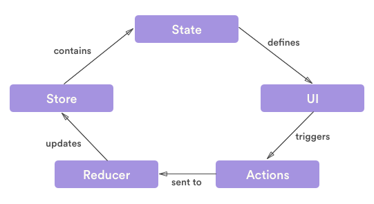

# 由redux 异步数据流引发的血案
> 本文假设你对redux已经有基本的了解，[redux文档](http://cn.redux.js.org/docs/introduction/index.html)

## 好奇心害死猫
redux是一个管理web应用数据状态（state）的javascript库，其使用单项数据流的模式试图让应用状态变得可控。其数据流向大概是这样的：    
        
依图所示，ui层只能通过触发（trigger）一个action来改变state，而触发一个action得通过`store.dispatch`方法，出于对关键方法`dispatch`的**好奇心**，我在redux的源码中将其翻了出来，方法定义在`src/createStore.js`中，并没有几行代码
```
  function dispatch(action) {
    // 特别需要注意的，action的类型只能是纯object，并不能处理函数
    if (!isPlainObject(action)) {  
      throw new Error(
        'Actions must be plain objects. ' +
        'Use custom middleware for async actions.'
      )
    }

    if (typeof action.type === 'undefined') {
      throw new Error(
        'Actions may not have an undefined "type" property. ' +
        'Have you misspelled a constant?'
      )
    }

    if (isDispatching) {
      throw new Error('Reducers may not dispatch actions.')
    }

    try {
      isDispatching = true
      // 关键在这里，dispatch的作用是传入action调用对应的reducer, 修改state
      currentState = currentReducer(currentState, action)
    } finally {
      isDispatching = false
    }

    var listeners = currentListeners = nextListeners
    for (var i = 0; i < listeners.length; i++) {
      listeners[i]()
    }

    return action
  }
```
很幸运，我找到了我想知道的，**dispatch的作用在于传入action调用对应的reducer生成新的state**，dispatch的参数只接受纯对象action，没毛病，action确实是纯对象，等等，在异步请求中我们传入的可不是action哦！！？
```
  export function fetchPostsIfNeeded(subreddit) {
      return (dispatch, getState) => {
        if (shouldFetchPosts(getState(), subreddit)) {
          return dispatch(fetchPosts(subreddit))
        }
      }
    }

  // fetchPostsIfNeeded执行之后返回的可还是函数
  dispatch(fetchPostsIfNeeded(subreddit));
```
这究竟是怎么发生的？诡异与心塞齐飞！！！

## thunkMiddleware干的好事
诡异的现象背后，可以大胆猜测，冥冥之中，一定有推力改写了store的dispatch，仔细看文档一定能发现蛛丝马迹。上述异步数据流能正常使用的前提是引入了`redux-thunk`这个专门的库
> 当 action 创建函数返回函数时，这个函数会被 Redux Thunk middleware 执行。这个函数并不需要保持纯净；它还可以带有副作用，包括执行异步 API 请求。这个函数还可以 dispatch action，就像 dispatch 前面定义的同步 action 一样。

看到这里，心中疑惑已解，应该可以释怀了吧，可是**好奇心**并没有要停止的意思，这个middleware是如何起作用的呢？找到applyMiddleware源码：
```
export default function applyMiddleware(...middlewares) {
  return (createStore) => (reducer, preloadedState, enhancer) => {
    var store = createStore(reducer, preloadedState, enhancer)
    var dispatch = store.dispatch
    var chain = []
    var middlewareAPI = {
      getState: store.getState,
      dispatch: (action) => dispatch(action)
    }

    // 传入getState和dispatch执行定义的middlewares
    chain = middlewares.map(middleware => middleware(middlewareAPI))
    // 合并middlewares执行结果，重新封装dispatch方法
    dispatch = compose(...chain)(store.dispatch)

    return {
      ...store,
      dispatch
    }
```
关键点：     
1. 传入getState和dispatch执行定义的middlewares    
2. 合并middlewares执行结果，重新封装dispatch方法     
> 前端工程化时代，各类框架充斥着middleware（redux、express、koa）、plugin(webpack)之类的设计，这其实就是一种**面向切面**思想的实现。仔细想想，前端的各类MVVM框架大量借鉴了后端设计思想，可谓，技术都是想通的

上述合并结果使用的compose，compose是怎么进行合并的呢？同样的，把代码剖出来：

```
    export default function compose(...funcs) {
      if (funcs.length === 0) {
        return arg => arg
      }

      if (funcs.length === 1) {
        return funcs[0]
      }

      const last = funcs[funcs.length - 1]
      const rest = funcs.slice(0, -1)
      return (...args) => rest.reduceRight((composed, f) => f(composed), last(...args))
    }
```

考虑到你可能跟我一样，对箭头函数还不是很习惯，换一种方式来说这个compose，其实要完成的工作不过是：
```
    var compose = function(f, g, h) {
      return function() {
        return f(g(h(...args)));
      };
    };
```

这会再来看看redux-thunk
```
    // 原版
    function createThunkMiddleware(extraArgument) {
      return ({ dispatch, getState }) => next => action => {
        if (typeof action === 'function') {
          return action(dispatch, getState, extraArgument);
        }

        return next(action);
      };
    }

    const thunk = createThunkMiddleware();
    thunk.withExtraArgument = createThunkMiddleware;

    export default thunk;


    // 去掉箭头函数
    function({dispatch, getState}) {
        return function(next) {
            // 在这里改写了dispatch的实现
            return function(action) {
                return {
                    if (typeof action === 'function') {
                      return action(dispatch, getState, extraArgument);
                    }
                    return next(action);
                    }
            }
        }

    }
```

套用到上述compose方法中，
```
    dispatch = compose(...chain)(store.dispatch)
    //相当于
    // chain = [...thunkMiddleware]
    // next = store.dispatch
    // 执行thunkMiddleware(store.dispatch);
    dispatch = function(action) {

            // 如果传入的是function，传入dispatch执行之
            if (typeof action === 'function') {
              return action(dispatch, getState, extraArgument);
            }

            // 否则按原处理
            return store.dispatch(action);
        }
    
```

绕了这么远，这个插件不过是重新封装了store.dispatch方法，增加了针对入参为function类型的处理

## 一点思考
redux的异步使用场景，应该早在意料之内，dispatch为何不直接将入参为function的情况进行处理，而是在中间件redux-thunk中提供，增加使用者的引入配置工作，以及学习曲线？

个人认为有两点：      
1. 保持dispatch的纯净，从redux各种纯函数的使用来说，这很redux(如果redux不提供这个中间件，相信你也有一百种方法将dispatch封装成你符合你需求的样子)      
2. 告诉你redux-thunk还有middleware这个东西，需要的话，你可以写一个符合自己需求的middleware

你是怎么认为的呢？


