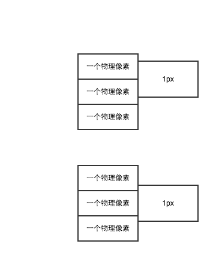

# 可能是理解viewport最好的方式
>一句话归纳
>>viewport的大小决定了，css中的设置多少像素能刚好占满屏幕。例如，viewport=320,那么设置div的宽度为320px,则div刚好能占满屏幕
## 移动设备中1px不等于1个物理像素
现如今，移动设备多已经采用高倍屏，像素分辨率（物理分辨率）要比逻辑分辨率高，下表为iphone分辨率数据
| 型号 | 像素分辨率 | 逻辑分辨率 | 倍率 |
| --- | --- | --- | --- |
| iphone5 | 640*1136 | 320*568 | 2 |
| iphone6 | 750*1334 | 375*667 | 2 |
| iphone6 plus | 1242*2208 | 414*736 | 3 |
可以使用如下代码来让viewport宽度等于逻辑分辨率宽度(width=device-width)
```
<meta id="viewport" name="viewport" content="width=device-width; initial-scale=1.0; maximum-scale=1; user-scalable=no;">
```
这个时候1px是不等于一个物理像素的，而是等于倍率个物理像素，如果我们在改变viewport的值，可以让css中的1px代表的物理像素有更多的可能
## 利用meta标签对viewport进行控制
```
<meta id="viewport" name="viewport" content="width=device-width; initial-scale=1.0; maximum-scale=1; user-scalable=no;">
```

| 属性名 | 说明 |
|------- | ------ |
|width | 设置viewport的宽度，为一个正整数，或字符串"width-device"|
|initial-scale | 设置页面的初始缩放值，为一个数字，可以带小数|
|minimum-scale | 允许用户的最小缩放值，为一个数字，可以带小数|
|maximum-scale | 允许用户的最大缩放值，为一个数字，可以带小数|
|height | 设置viewport的高度，这个属性对我们并不重要，很少使用|
|user-scalable | 是否允许用户进行缩放，值为"no"或"yes", no 代表不允许，yes代表允许|

width和scale都可以用来设置viewport的值
```
viewport = width;
viewport = idea viewport /scale;
```
在网上搜索到一种说法:
>当同时设置了width和scale的时候，viewport的取值等于上面两个等式计算之后得到的值大的那一个，我们常常会看到width和initial-scale同时设置的情况，那完全是为了兼容各个浏览器

然而，尝试之后，发现那个说法并不是很准确。如果只设置width不设置scale,在width的值大于设备逻辑分辨率的时候，内容没有如愿的充满整个设备，而是出现横向滚动条（即没有主动缩放），有点打破开篇总结的结论的意思，那真的是非常令人沮丧的。所以说：
>同时设置width和scale，让它们通过公式计算得到的viewport的值一样，是最为安全的，也不会让人产生疑惑
## 用viewport来解释两个灵异现象
- 同样的设备，同样是设置了border = 1px，为什么别人的网页上的线看起来比我的细？ 现在很好解释了，通过设置viewport，可以改变css中的1px用多少物理像素来渲染，设置了不同的viewport，当然1px的线条看起来粗细不一致。（处女座的设计，还真有可能会为了你这1px的线条看起来太粗而找你麻烦）
- 为什么同样是1px的线，在同一个设备的同一个网页中，不同位置看到的粗细不一致？如下图所示，倘若在css中的1px=1.5个物理像素，那么在页面中的不同位置，1px的线跨越的物理像素有可能是两个，也有可能是三个，用3个物理像素表示的线肯定是要比用两个物理像素表示的线要宽的（虽然差异不明显）。解决方案：设置viewport=设备的物理分辨率，让1px=一个物理像素

## 使用viewport来实现等比适配
倘若我们要做到把设计图根据设备的宽度等比缩放，整个装到设备中。这种适配方案对开发来说是最为友好的，拿到设计图即可，不需要跟设计有过多的沟通，设计也不需要出多套图，降低了成本。
>把设计图想象成一张300*300的图片，分别按照宽度等比的装到150*300、300*300，600*300的设备中，那么图片的大小将分别变成150*150（没装满容器，可能要增加点纯色背景），300*300（刚好），600*600（比容器高了，得出现滚动条了）

倘若设计图是640*1136，为了在设计图上量到多少样式中就能写多少，我们有如下代码
```
    var clientWidth = document.documentElement.clientWidth,
    viewport = document.querySelector('meta[name="viewport"]');
    viewportScale = clientWidth / 640;
    viewportWidth = 640;
    viewport.setAttribute('content', 'width=' + viewportWidth + ', initial-scale=' + viewportScale + ', maximum-scale=' + viewportScale + ', user-scalable=0');
    }
```
当然问题也比较明显：

- 上面提到的两个灵异现象，画不了细线和1px的线在不同位置粗细不一致，都会存在。进化的方案，将viewport设置为物理分辨率，同时为了在设计图上量到多少样式写多少，可能需要在打包脚本上做一些预处理（无论是百分比还是rem的方式）

- 生硬的按照设计图进行等比适配，字体的大小等看起来并不是很舒适。因为css中的1px应该代表多少个物理像素，硬件厂商肯定有过细致的考虑的，而我们现在修改了这个数值。成本高一点的方案：文字流式、控件弹性、图片等比缩放，需要的时候，设计出多套图，需要开发跟设计有足够的沟通，media query也要广泛使用

- 在不同宽高比的设备上，显示效果不尽如人意。页面底部的一个按钮，在高屏（指的是相对于宽来说比例高）中显示靠上；在矮屏（指相对于宽来说比例矮）中显示靠下，甚至需要滚动一下屏幕才能看见，这个用户体验非常不好，更别说极端情况下不允许出现纵向滚动条了。在这种情况下可能要使用一下media query

