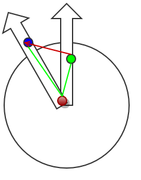

#  跟手转动的罗盘指针
> 跟手拖拽，转盘旋转，都不是难事，然而跟手转动一个转盘或者转盘上的指针，确是个值得思考的问题
> [查看效果](https://zengwenfu.github.io/wheel/)(请用手机打开，或者用chrome的手机模式打开)

## 分析
1. 跟手拖拽的做法是：touchstart的时候记录下原始位置，touchmove的时候拿到位置的变化，动态更新位置就可以了
2. 转盘转动的做法是：设定圆心为转动原点，动态的修改旋转角度（或者弧度）
3. 现在我们需要在手发生移动的时候，映射到角度或者弧度的变化，此时通过x轴方向和y轴方向的距离变化来映射将会是一片困顿，是时候发挥你的想象力了，请拿起你的纸和笔。这里就不卖关子了，直接上图：


>注意到图片红色的点是圆心，绿色的点是touchstart时候记录下的起始点，蓝色的点是touchmove的过程中不断变化的目标点。我们的目标很明确，计算指针变化的角度（或弧度），用我仅有的初中数学知识思考得知，知道三角形的每个顶点，是可以求出每个顶角的角度。运用三角形的余弦定理，求弧度值：

```
    //获得point2顶角的弧度值
    //point1传入起始点，point2传入圆心，point3传入结束点，可求得指针运动的夹角弧度
    function getAngle(point1, point2, point3) {
        var bb = (point2.y - point1.y)*(point2.y - point1.y) + (point2.x - point1.x)*(point2.x - point1.x);
        var aa = (point3.y - point1.y)*(point3.y - point1.y) + (point3.x - point1.x)*(point3.x - point1.x);
        var cc = (point3.y - point2.y)*(point3.y - point2.y) + (point3.x - point2.x)*(point3.x - point2.x);
        var cosa = (bb + cc - aa)/(2*Math.sqrt(bb)*Math.sqrt(cc));
        return Math.acos(cosa);
    }
```

4. 刚才我们只考虑了目标点在**初始点和圆心所在直线**的右边的情况，并没有考虑目标点在左边的情况


>这种情况还是好理解的，弧度值为-getAngle(point1, point2, point3),判断目标点**初始点和圆心所在直线**的左边还是右边，这又要用到初中数学的知识了，这跟斜率是有点关系的，知识改变命运啊

```
    //判断point3在point1和point2组成的直线的左边还是右边
    //返回1代表右边，返回-1代表左边
    function duration(point1, point2, point3) {
        var k = (point2.y - point1.y)/(point2.x - point1.x);
        var b = point1.y - k * point1.x;
        if(k>0 && point3.y > point3.x*k + b) {
            return 1;
        } else if(k<0 && point3.y > point3.x*k +b) {
            return 1;
        }
        return -1;
    }
```

### 完整的程序代码
```
    <!DOCTYPE html>
        <html>
        <head>
            <meta charset="utf-8">
            <title>跟手转动罗盘指针</title>
            <meta name="viewport" content="width=device-width,initial-scale=0.5,minimum-scale=1.0,user-scalable=0">
            <style type="text/css">
                * {
                    padding: 0;
                    margin: 0;
                }
                html, body, .container {
                    width: 100%;
                    height: 100%;
                    background-color: rgb(5, 15, 77);
                    position: relative;
                }

                .circle {
                    width: 320px;
                    height: 262px;
                    position: absolute;
                    top: 50%;
                    margin-top: -131px;
                    background-image: url(img/circle.png);
                    background-size: 100% 100%;
                }

                .line {
                    width: 72px;
                    height: 138px;
                    background-image: url(img/line.png);
                    background-size: 100% 100%;
                    top: 0;
                    left: 123px;
                    position: absolute;
                    transform:rotate(0deg);
                    transform-origin:36px 138px;
                    -webkit-transform:rotate(0deg);
                    -webkit-transform-origin:36px 138px;
                }
            </style>
        </head>
        <body>
            <script type="text/javascript">
                var clientWidth = document.documentElement.clientWidth,
                    viewport = null,
                    viewportWidth = 'device-width',
                    viewportScale = 1;
                if (clientWidth > 320) {
                    viewport = document.querySelector('meta[name="viewport"]');
                    viewportScale = clientWidth / 320;
                    viewportWidth = 320;
                    viewport.setAttribute('content', 'width=' + viewportWidth + ', initial-scale=' + viewportScale + ', maximum-scale=' + viewportScale + ', user-scalable=0');
                }
            </script>
            <div class="container">
                <div class="circle">
                    <div class="line" id='line'></div>
                </div>
            </div>
            <script type="text/javascript" src="js/zepto.js"></script>
            <script type="text/javascript">
                //获得point2顶角的弧度值
                function getAngle(point1, point2, point3) {
                    var bb = (point2.y - point1.y)*(point2.y - point1.y) + (point2.x - point1.x)*(point2.x - point1.x);
                    var aa = (point3.y - point1.y)*(point3.y - point1.y) + (point3.x - point1.x)*(point3.x - point1.x);
                    var cc = (point3.y - point2.y)*(point3.y - point2.y) + (point3.x - point2.x)*(point3.x - point2.x);
                    var cosa = (bb + cc - aa)/(2*Math.sqrt(bb)*Math.sqrt(cc));
                    return Math.acos(cosa);
                }


                //判断point3在point1和point2组成的直线的左边还是右边
                function duration(point1, point2, point3) {
                    var k = (point2.y - point1.y)/(point2.x - point1.x);
                    var b = point1.y - k * point1.x;
                    if(k>0 && point3.y > point3.x*k + b) {
                        return 1;
                    } else if(k<0 && point3.y > point3.x*k +b) {
                        return 1;
                    }
                    return -1;
                }

                var line = document.getElementById('line');
                var oX = 0;
                var oY = 0;
                //全局记录
                var rolate = 0;
                //圆心
                var pointCenter = {
                    x: 159,
                    y: 187
                }
                //初始移动点
                var pointO = false;
                var ro = 0;

                //在手机浏览器（如微信）中打开页面拖动的时候页面会漏底
                //禁掉默认事件，不然影响咱们的更手转动
                $(document).on('touchstart', function(e) {
                    e.preventDefault();
                }).on('touchmove', function(e) {
                    e.preventDefault();
                });

                line.addEventListener('touchstart', function(e) {
                    var touche = e.touches[0];
                    oX = touche.clientX;
                    oY = touche.clientY;
                    pointO = {
                        x: oX,
                        y: oY
                    }
                });

                line.addEventListener('touchmove', function(e) {
                    e.stopPropagation();
                    var mx = e.touches[0].clientX;
                    var my = e.touches[0].clientY;
                    
                    ro = getAngle(pointO, pointCenter, {
                        x: mx,
                        y: my
                    });

                    ro = ro*duration(pointO, pointCenter, {
                        x: mx,
                        y: my
                    });

                    ro = rolate + ro;
                    $('#line').css({
                        '-webkit-transform': 'rotate('+ ro +'rad)',
                        'transform': 'rotate('+ ro +'rad)'
                    });
                });

                line.addEventListener('touchend', function() {
                    rolate = ro;
                });
            </script>
        </body>
        </html>
```

## 结语
> 这类效果，代码不需要很多，但是找到其中的规律再转化为机器认识的语言绝非易事，难就难在这个数学建模的过程，需要一点想象力，可以给予的经验就是，拿起你的笔和纸，去画，灵感自来。
> [源码在这里](https://github.com/zengwenfu/wheel)
> 欢迎一起交流


