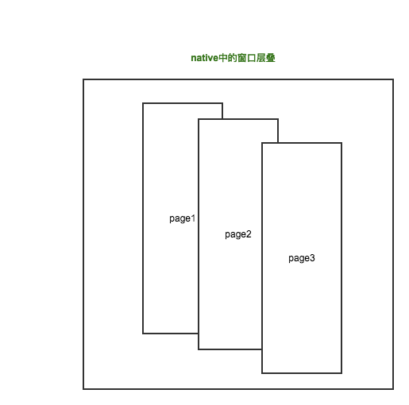

# 【烤面筋】你真的了解混合编程？
> 移动互联网时代，混合编程对于前端同学来说是不可回避的课题，相信大部分同学都有曾做过并且使用上堪称熟练，但是面试的时候，你的回答真的能用面试官感到满意么？

## 一、什么是混合编程？
基于webview的h5具有跨平台的特性，但是在体验上跟原生native组件比起来要逊色不少（至少目前是这样），并且功能上也会有局限（例如消息推送，获取设备网络状态等等），另外，一些安全性要求较高的敏感数据也不宜放在网页中。所以我们需要**混合编程**，结合使用两者，发挥各自的优势。

混合编程在形式上也有不同的偏重点，目前市面上流行的ionic、phoneGap和h5+（hbuilder），已经将h5和native的桥接通信封装得密不透风，并且实现了足够多的native接口让使用者选择调用（打包的时候还可以选择打包），使用者更多的是使用h5技术去开发，无需native的同事支持，这种形式的侧重点在h5上，native只需要搭建一个壳，适合没有足够人力的小团队；而技术、人力资源雄厚的公司，更愿意自己实现一套H5和native的通信链路，灵活的定制需要的native接口供少量的h5页面使用，更多的功能交由原生团队进行开发，这种形式的侧重点就在native上了。
> 并不是说公司自身实现一套h5和native的互调机制侧重点就一定在native上，这完全看公司的战略，有资源实现自己的一套东西，当然能更加灵活

说了这么多，不知道你有没有发现，混合编程的核心在于实现一套h5和native的通信链路（互调机制），如果你只是把自己定位为一个使用者，也许并不用关心这其中的实现细节，但可以肯定的是，在面试的时候，你在这个话题上跟面试官扯不上几句，还是那句话，**跳出自己的思维舒适区，深入原理**

## 二、h5和native是如何互调的
> 参考资料：[H5与Native交互之JSBridge技术](http://tech.youzan.com/jsbridge/)

native调用js有现成的方法，方式比较简单：
```
    /***********native 调 js***************/
    // Swift
    webview.stringByEvaluatingJavaScriptFromString("Math.random()")  
    // OC
    [webView stringByEvaluatingJavaScriptFromString:@"Math.random();"];

    /*************android 调 js************************/
    // java调js
    webView.loadUrl("javascript:Math.random();"); 
```

js调用native，android平台和ios平台的支持程度不太一样。     
**在android平台中，有三种方式：**      
1）通过注解的方式向webview当中注入java方法
```
// java代码
class JSInterface {  
    @JavascriptInterface //注意这个代码一定要加上
    public String getUserData() {
        return "UserData";
    }
}
webView.addJavascriptInterface(new JSInterface(), "AndroidJS");  

// js代码
alert(AndroidJS.getUserData()) //UserDate  
```
2) 在android webview中重写原生的promat、console.log或者alert（一般是重写promat，因为这个方法用得少）
```
    class MyChromeClient extends WebChromeClient {  
        @Override
        public boolean onJsPrompt(WebView view, String url, String message, String defaultValue, JsPromptResult result) {
            // 这里就可以对js的prompt进行处理，通过result返回结果
        }
        @Override
        public boolean onConsoleMessage(ConsoleMessage consoleMessage) {

        }
        @Override
        public boolean onJsAlert(WebView view, String url, String message, JsResult result) {

        }
    }
```
3) 监听伪协议请求，在ios中只能采取这种方式，所以适合让ios来现身说法

**在ios平台中，监听伪协议实现js对native的调用：**    
在UIWebView内发起的所有网络请求，都可以通过delegate函数在Native层得到通知，那么我们可以定义一个伪协议，例如:`jsBridge://`，然后在delegate中监听所有的网络请求，一旦发现是jsBridge开头的，将直接转入响应的调用逻辑中，这种曲线救国的方式，在android平台上也同样适用。

发起这样的网络请求，我们可以通过location.href，也可以载入一个隐藏的iframe，通过location.href的方式请求有一个明显的漏洞，当多个请求连续发起的时候，在native层只能监听到最后一个请求，其它请求调用都将被忽略，所以应当采取iframe的方式

**适配层：**
如你所见，混合编程中，h5的调用代码是统一的，那是因为在你看不见（或者不想看见）的地方，别人进行了android和ios平台的适配，并封装了底层调用方式
> 这里就不贴代码了，当做一个课外作业去实现这套适配代码，在本章开头处提供的参考资料的文末，有赞团队贴了它们的库的封装，而且，就在你天天提交代码的仓库中，说不定已经有某个大牛同事已经实现了一套成熟的封装，你还没来得及研读

## 三、webview窗口页面跳转
> 虽说理解了h5跟native的通信机制之后，接口的调用并不难理解，但是由于对native的机制不太了解，经常有同学分不清webview中的页面跳转`location.href`和调用native的方法重新创建一个webview窗口进行的页面切换有何区别，所以这个问题有必要来说明一下



我们知道，通过`location.href`进行的url跳转，当前webview容器里面重新载入新的资源内容，但是在native应用中，是通过`navigator`的`push`和`pop`来管理窗口的，当从列表页跳转到详情页的时候，新建一个详情窗口，`push`到`navigator`中，新的详情窗口将层叠在列表窗口中，当从详情页返回时，详情窗口将会被从`navigator`中`pop`出来（并进行销毁），列表窗口重新成为当前可见的活动窗口

我们在进行混合编程的时候，不希望在页面跳转的时候，沿用浏览器在当前窗口重新载入资源内容的体验方式(往往有一个空白页的过程）；而是采取调用native的新建窗口方法，打开一个新的webview窗口，载入新的页面链接内容，这样就可以拥有native的过渡动画体验

以上讨论的是多页面应用，但单页spa应用中，通过location.history模拟的路由跳转，通过ajax载入的功能页面，也可以在一个webview窗口中模拟native的过渡动画

> 千万不要混淆`location.href`和窗口跳转了，前者只有一个webview，后者有多个webview窗口。
> 另外，单页spa应用也是可以模拟窗口跳转的过渡动画的

## 总结
如果你只是会用，那么公司很乐于把你招进来干点脏活累活；但是如果你理解深沉的实现机制，公司会希望将你招进来搭建底层框架，甚至是作为一个前端架构师指挥大家干活


