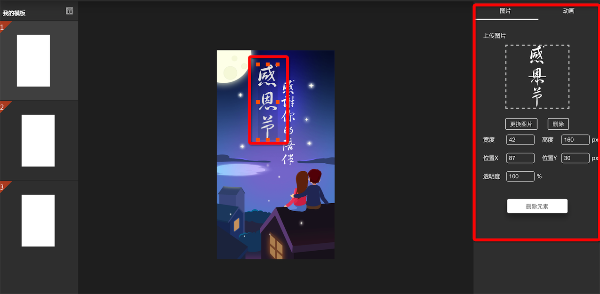

# node版易企秀，从设计到拥有
> 想必你一定使用过易企秀或其它微场景生成工具制作过炫酷的h5页面，除了感叹其神奇之处有没有想过其实现方式呢？
> 从设计者的角度来看待问题，会有不一样的收获，本文将从零开始，使用node技术来设计实现一款精简版的易企秀

## 目录
1. 实例实现
2. 实例模板化与渲染
3. 前端可视化操作
4. 总结

## 一、实例实现
> 自动化/可视化工具的实现，无不是大量重复实例的一种模板化，微场景生成工具也不例外，所以首先需要探讨具体的一个微场景是怎么实现的

来看下面这个实例：


要实现这样的场景，我们首先得把任务分解下：

1. 布局：整个场景可以分为很多屏（页），每一屏上有动画元素（文字/图片）
```
    <!-- --------------html---------- -->
    <div class="page-box" id="page1">
        <div class="item page1-item1">
            ...
        </div>
        <div class="item page1-item2">
            ...
        </div>
        <div class="pre-item">
            ...
        </div>
    </div>
    <div class="page-box" id="page2">
        <div class="item page2-item1" data-cls="bounceIn1000" data-ts="0">
            ...
        </div>
        <div class="item page2-item2" data-cls="bounceIn1000" data-ts="1000">
            ...
        </div>
        <div class="pre-item">
            ...
        </div>
    </div>


    <!-- --------------css---------- -->
    // 每一屏（page-box）都是absolute布局，便于为每屏增加入场出场动画（减少重绘重排）
    // 每一屏宽高皆为100%，默认隐藏，入场增加入场动画，并设置为可见
    .page-box {
        position: absolute;
        top: 0;
        z-index: 1;
        width: 100%;
        height: 100%;
        visibility: hidden;
        background: no-repeat center center #FFFFFF;
        background-size: 100% 100%;
    }

    .page-box.show {
        visibility: visible;
    }
    // 屏内动画项目，也都采用abasolute布局，just因为，是动画元素
    .item {
        position: absolute;
        background-repeat: no-repeat;
        opacity: 0;
        text-align: center;
    }
```
2. 屏间切换：事件触发，过渡动画
```
    /**
     *  下滑手势，页面上翻
     *  上一屏（prev）增加入场动画slideZoom_tInt，本屏增加离场动画slideZoom_tOut
     */
    pre: function() {
        var $el = $(".page-box.show");
        var $prev = $el.prev(".page-box")[0] ? $el.prev() : $(".page-box").last();
        $prev.addClass("show").show().css({
            "-webkit-animation":"slideZoom_tInt 0.5s linear",
            "animation":"slideZoom_tInt 0.5s linear"    
        });
        $el.css({
            "-webkit-animation":"slideZoom_tOut 0.5s linear",
            "animation":"slideZoom_tOut 0.5s linear"
        });
        setTimeout(function(){
            $el.removeClass("show");
            ...
        },500);
    }

    /**
     *  滑动事件监听
     */
    //控制滑动
    //不禁止默认事件 他丫的不能滑
    document.addEventListener('touchmove', function(event) {
        event.preventDefault();
    }, false);
    $(document).on('swipeUp', function() {
        slider.next();
    }).on('swipeDown', function() {
        //手势下滑，向上翻页
        slider.pre();
    });
```
3. 屏内项目控制（文字和图片）：引入动画库animate.css来设置屏内项目的动画效果（所以说是精简版易企秀）
```
    /**
     *  动画效果控制，动画效果播放、时间间隔
     */
    
    //动画一个个播放，递归调用
    var i = 0;
    function startShow(callback) {
        if(i === itemLength){
            callback && callback();
            return ;
        }
        var item = items.eq(i);
        var cls = item.attr('data-cls');//动画类
        var ts = item.attr('data-ts');//下一个动画开始间隔时间
        item.addClass(cls);
        i++;
        setTimeout(function() {
            startShow(callback);
        },ts);
    };

    //播放某一屏的动画
    function showItem(id, callback) {
        var self = this;
        i = 0;
        items =  $('#' + id + " .item");
        itemLength = items.length;
        if(!callback) {
            callback = function() {
                self.showPreItem(id);
            }
        }
        startShow(callback);
    },
```
4. 页面加载进度控制：阻塞页面加载进度的无非图片，枚举页面使用到的所有图片（可以使用程序遍历目录），判断Image对象的complete状态或者监听onload事件来判断图片是否加载完成，篇幅原因，代码就不贴出来了

## 二、实例模板化与渲染
> 所谓模板化，无非是在重复实例中提取共性的东西定义**数据模型**，并且使用模板标签来描述，渲染的过程中用数据填充模板占位符
> 在此选用了nunjucks作为模板引擎

我们先来分析下，微场景页面的组成部分：
1. 屏/页（page-box）：背景色、背景图片、入场动画和出场动画
2. 屏内项目：位置、宽高、透明度、动画类、动画持续时间、下一个动画的间隔时间、图片路径/文字以及文字效果

于是数据模型可以定义为：
```
    //页面数据
    pages: [
        {
            burl: String, //背景图片
            inAnimate: String,
            outAnimate: String,
            bgColor: String,
            items: [ //页面项目
                {
                    px: String, //位置x 必选
                    py: String, //位置y 必选
                    width: String, //宽度 必选
                    height: String, //高度 必选
                    transparent: String,//透明度  可选
                    animateClass: String,//动画 可选
                    animateDuration: String, //动画持续时间，默认2000
                    nextAnimateTime: String, //下一个item动画开始的时间间隔
                    zIndex: String, //可选
                    imgUrl: String,// 图片路径 //可选
                    text: String, //文本
                    textStyle: {
                        'color': String,
                        'font-size': String
                    }
                }
                ...
            ]
        },
        {
            ...
        }
        ...
    ]
```

根据数据模型来编写模板
```
    <!-- ---------html模板片段--------- -->
    //遍历pages生成每一屏的div
    //遍历page的items生成动画项目div
    
    
        
        
        <div class="page-box" id="page{{i}}">
            
                
                <div class="item page{{i}}-item{{j}}" data-cls="{{ item.animateClass }}{{item.animateDuration}}"  data-ts="{{ item.nextAnimateTime }}"  data-ts="500"   >
                    
                        {{ item.text }}
                    
                    
                        
                    
                </div>
            
            <div class="pre-item"><div class="pre-wrap"><div class="pre-box1"><div class="pre1"></div></div><div class="pre-box2"><div class="pre2"></div></div></div></div>
        </div>  
    

    <!-- ---------css模板片段--------- -->
    /************* item style ***********************/
    
    
        
        
        #page{{i}} {
            
                background-image: url({{page.burl}});
            
            background-color: {{page.bgColor}};
        }
        
            
            .page{{i}}-item{{j}} {
                width: rem({{item.width}});
                height: rem({{item.height}});
                left: rem({{item.px}});
                top: rem({{item.py}});
                
                    {{key}}: {{value}};
                
            }
        
    

    //这里要重点说明的，数据模型中的所有item对应的，动画类和持续时长作为key值
    //去重之后，构造animateClasses对象，遍历该对象，生成相应的动画类
    //例如动画类bounceIn1000：就表示动画库中的bounceIn，并且持续时长1000毫秒
    /**************** animate class **************************/
    
        .{{cname}} {
            -webkit-animation: {{cvalue.ac}} {{cvalue.ad}}s ease 1 both;
            -webkit-animation-play-state: initial;  
            animation: {{cvalue.ac}} {{cvalue.ad}}s ease 1 both;
            animation-play-state: initial;
            opacity: 0  1 ;
        }
    
```

渲染过程：
1. 复制用到的图片
2. rem预处理
3. 根据数据渲染模板
```
    /**************build代码片段*************************/
    //解析view
    var content = htmlTemplate.render('view.html', config);
    utils.createFile(target + '/view.html', beautify_html(content, {
        'max_preserve_newlines': 0 // 去掉过多的空行
    }));
    //解析样式
    var styleContent = htmlTemplate.render('css/style.css', config);
    utils.createFile(target + '/css/style.css', beautify_css(px2rem(styleContent), {
        'max_preserve_newlines': 1 // 去掉过多的空行
    }));

    //解析main.js
    var mainJsContent = htmlTemplate.render('js/main.js', {
        list: images
    });
    utils.createFile(target + '/js/main.js', beautify_js(mainJsContent, {
        'max_preserve_newlines': 1 // 去掉过多的空行
    }));
```

## 三、前端可视化操作
> 在上一步模板化之后，我们已经可以根据数据和模板生成场景实例，那么前端可视化操作要做什么就比较清晰了，**前端可视化操作的目的在于根据数据模型构造数据实例**，前端的可视化操作应该包括设置每一屏的背景色/背景图片，并且可以增加或删除一页，在每一屏中可以增加文本或者图片项目，并且设置对应的属性




在此采用了以上两图的设计风格：
1. 顶部文本和图片按钮可以为当前page增加文本和图片
2. 左侧控制屏/页的增删，以及切换当前编辑屏/页
3. 中部为编辑舞台，显示当前屏/页的背景以及项目
4. 右侧为属性设置面板，当屏/页获得焦点，编辑的是屏/页属性（背景和入场出场动画），当动画项目（文本或者图片），编辑的是动画项目的属性

同样的，我们要将任务分解：
1. 控制page增删与切换，属性设置的Page.js
2. 控制文本项目增删，属性设置的textItem.js
3. 控制图片项目增删，属性设置的imageItem.js
4. 右侧属性设置面板控制rTab.js
5. 拖拽控制ZResize.js
6. 图片上传ZUpload.js
> 这些个步骤每一步要写的话，篇幅都可以长到独立成文，例如，另一篇文章:[div拖拽缩放jquery插件编写——带8个控制点](http://www.jianshu.com/p/822afede7489)已经详细说过，本文就不再拓展，如果有需要，可以私信我，有必要再整理

通过前端可视化的操作，构造数据模型实例，传入后台，后台再通过上一步的模板进行渲染，那么整一个核心功能就走通了~~~

其它的入库保存，展示，预览功能，则是需要慢慢丰富的过程
> 先把核心骨架搭建完毕，再去丰富皮肉，是一个软件从无到有的重要心法

## 四、总结
本文重在说明设计步骤和实现思路，省去了很多实现细节，并非面面俱到，并且也不方便公布所有源代码，更细致的讨论，可以私信我，定尽力解答。

本文方法论：
1. 任务分解
2. 实例模板化
3. 核心骨架搭建、再丰富皮肉功能

[菲麦前端专题，汇聚前端好文，邀您关注！](http://www.jianshu.com/c/4f96d8bcb372)

