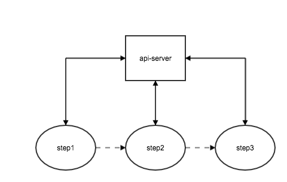
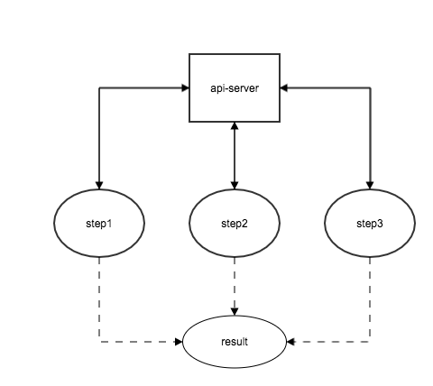
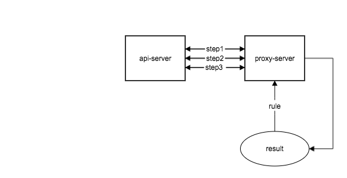

# 基于代理服务的接口合并方案
> 过多的接口请求是web前端的主要性能瓶颈之一，接口合并是刚需。
> 后台的接口设计有其既有粒度，对每个功能场景额外的增加合并的接口，工作量巨大，且场景难以覆盖。
> 增加一台离接口服务器很近的代理服务器，定义一套接口合并的规则，代理服务器解析前端发来的规则，对接口服务器发起近距离请求，合并后返回。

<h2>目录</h2>
- <a href="#1">一、web前端开发的困境</a>
- <a href="#2">二、代理服务的接口合并方案</a>
- <a href="#3">三、规则定义</a>
- <a href="#4">四、方案的node实现----freedom-api</a>

<h2 id='1'>web前端开发的困境</h2>



在web开发中，前端为了一个实现一个功能，连续的请求多个接口的场景并不少见。图一示例中，后一个接口依赖于前一个接口的请求结果，于是你经常要这样去组织你的接口请求step1.then(step2).then(step3)（promise语法），图二中，step1,step2,step3虽然没有依赖关系，但是同样需要跟api-server交互三次，web应用中，没多一秒等待都意味着多一份失去。

你可能会抱怨后端的同事，为何不把这几个接口合并，然而后端的同事就会反驳你：“你这个场景需要step1->step2->step3，那个页面只需要step1 -> step2，甚至有些页面只需要step1，我如何给你合并？”你可以继续说，可以提供三个这样的接口嘛，那么后台的同事可能直接会崩溃，这样的场景何其多，新增一个场景新增一个接口，后台就得发一次版本。

<h2 id="2">代理服务的接口合并方案</h2>


- 代理服务（proxy-server.png）和接口服务器（api-server）的网络链路应该尽量的“近”。部署在同一机房同一网段的服务器上，甚至是同一服务器上；增加服务器硬件性能；负载均衡集群等；这些都是“简短“网络链路的有效手段
- 前后端约定好一套接口合并的规则，代理服务只需要做好解析规则请求合并的工作，一旦部署将保持稳定，接口合并的主动权将掌握在前端，前端可以根据场景的变化自由的组合合并规则
- 代理服务与接口服务走的同样是http/https协议，对接口服务器没有依赖嵌入，前端直接请求接口服务器也是没有问题的，换句话说：老的访问方式完全不受影响。

这种合并方案为什么能极大的提升接口访问速度
> 对于需要访问三个有依赖关系的接口的场景（上图一）：传统的前端直接请求接口服务器的方式，前端跟服务器的交互相当于需要走三次”远路“（为什么说前端直接连接口服务器认为是”远路“，因为前端的网络状态无法保证，对于移动端设备常常只能在3g/4g的网络环境下，况且移动端硬件性能并不占优），并且需要串行等待；然而使用代理服务器的方式，前端只需要走一次”远路“把规则告诉代理服务器，代理服务器再跟它老表接口服务器要三次数据（代理服务器跟接口服务器的访问速度往往远高于前端与服务器的直接交互的访问速度，根本不是一个量级的）

没有数据支撑的理论臆测都是在耍流氓，我在同一台服务器上分别部署了接口服务（api-server），和使用了上述代理方案的**node实现**（freedom-api，后文会详细说明），接口服务器提供了两个有依赖关系的串行接口，使用手机在不同的网络下分别使用传统的直连方式和走代理服务合并接口的方式进行测试，得到如下测试结果：


由图可见，在三种网络环境下，代理合并的方式的访问速度都明显高于传统直连的方式，并且网络状况越差，体现得越明显

<h2 id="3"> 规则定义 </h2>
> 规则采用json字符串参数传输，前端负责构造规则字符串，后端直接对规则字符串进行解析
> 规则借鉴promise的all和then语法，切合前端开发人员的开发习惯

<h3 id="3.1">规则总览</h3>
```
    //正确的规则
    var rule = {
        start: {
            ...
            then: 'step1'//下一步指针
        },
        'step1': [
            {
                name: 'step1-1',
                ...
            },
            {
                name: 'step1-2',
                ...,
                then: 'step2' //指向下一个step
            }
        ],
        'step2': {
            name: 'step2',
            ...
            then: false
        }
    }
```
规则的最外层有如下几个参数：

- dataTest：每个接口返回值的简单校验规则（非必传），例如：接口服务器定义的接口只有返回值为`"0"`才是成功，使用`$data.code === "0"`(其中$data是规则的保留变量，用于获得每个接口的返回值)，当条件不满足的时候，代理服务将会把已经请求成功的接口数据以及错误信息返回，不再进行后续的接口请求
```
    {
        "idData": {
            "code": "0",
            "msg": "",
            "data": {
                "id": "1"
            }
        },
        "infoData": {
            "code": "2",
            "msg": "数据不存在"
        },
        "error": {
            "msg": "Error: 数据不存在",
            "step": "info"
        }
    }
```
- errorMsg: 当dataTest条件不满足的时候，取请求返回结果的那个字段作为错误信息（非必传），例如：`errorMsg: "msg"`，表示取resData.msg作为错误提示
- steps/start: 规则最外层的其它key值定义了合并请求的每个步骤，其中start是整个合并请求的入口步骤，其它步骤可以任意命名，每个步骤可以是对象也可以是数组，对象定义了单独的接口请求，数组定义了并行的多个请求（类似于promise.all），数组内部对象不能再嵌套更深层次的step。

<h3 id="3.2"> steps中的具体字段 </h3>

| 字段名 | 类型 | 说明 |
| --- | --- | --- |
| url | string | 接口的请求地址 |
| type | string | 请求类型，取值为get或者post |
| params | obj | 请求参数，如果要获取上一个step返回结果的数据作为参数，可以使用`$data`（如果上一步是一个数组，那么使用`$data[i]`来获取对应数组项目的数据）关键字来获取，例如，上一个step返回`{code: '0', msg: '', data:{ id: '1'}}`，那么$data.data.id = '1' |
| name | string | 这个步骤的名称，如果需要将这个步骤的请求结果返回，那么以`name + 'Data'`作为该请求结果的key值，如name为step，且result = true，那么返回结果`{stepData: {...}, ..}` 为了避免数据覆盖，应该要保证每个step都不重名。如果发生了异常，也以name值来标识发生错误的step |
| result | boolean | 这个步骤的请求结果需不需要返回true返回，false不返回 |
| then | string/boolean | 为string的时候指向下一个step，为false的时候，这个step为最后一步。当一个step为数组的时候，step字段加在数组中的最后一项，如果未加在最后一项，那么其后的所有请求将不再执行 |

<h3 id="3.3">返回值说明</h3>
```
    //所有step执行正常1
    {
        "idData": {
            "code": "0",
            "msg": "",
            "data": {
                "id": "1"
            }
        },
        "infoData": {
            "code": "0",
            "msg": "",
            "data": {
                "info": "恭喜你，拿到了数据"
            }
        }
    }

    //step发生了错误
    {
        "idData": {
            "code": "0",
            "msg": "",
            "data": {
                "id": "1"
            }
        },
        "infoData": {
            "code": "2",
            "msg": "数据不存在"
        },
        "error": {
            "msg": "Error: 数据不存在",
            "step": "info"
        }
    }

```
1. 对于每个step，如果result=true，那么它的请求结果将以其name+'Data'为key值返回
2. 如果在某个step处理的过程中发生了错误，那么后续的step将不再执行，返回已经处理过的step(包括发生错误的step),还增加一个error对象，包含msg，和错误发生的step的name标识

<h2 id="4">四、方案的node实现----freedom-api</h2>
> node的语言特性使得它非常契合与代理服务的场景
> 在很多公司的技术栈里面已经有node，植入一个freedom-api并不困难
> 如果公司的技术栈中还没有node节点，那是时候引入一个了，node在高并发，前后端同构等等方面都有突出表现

freedom-api地址: [freedom-api](https://github.com/zengwenfu/freedom-api)
写得这么卖命，给颗星吧~~

