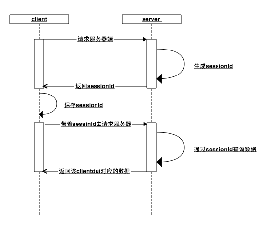
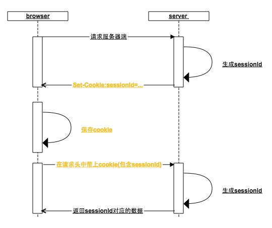
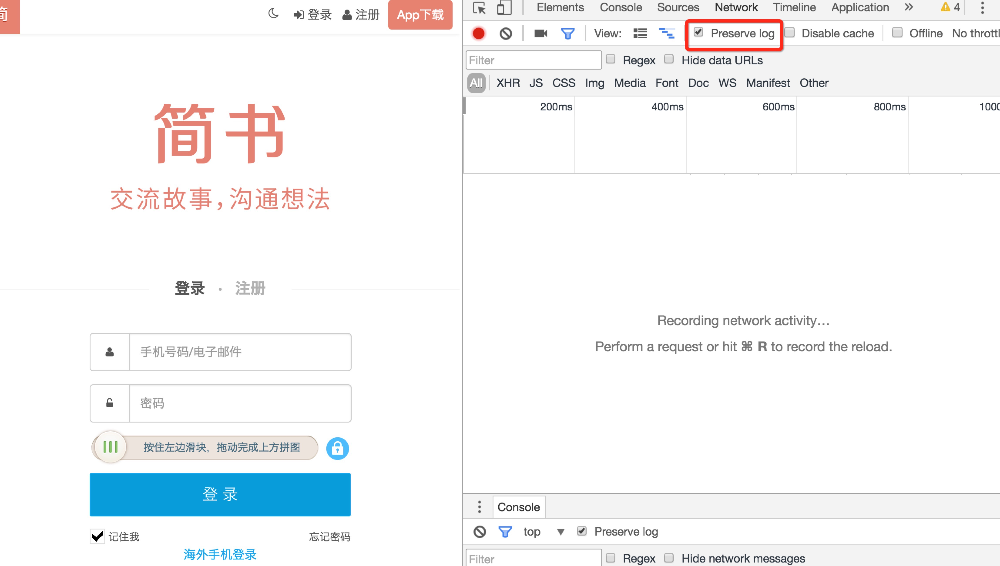
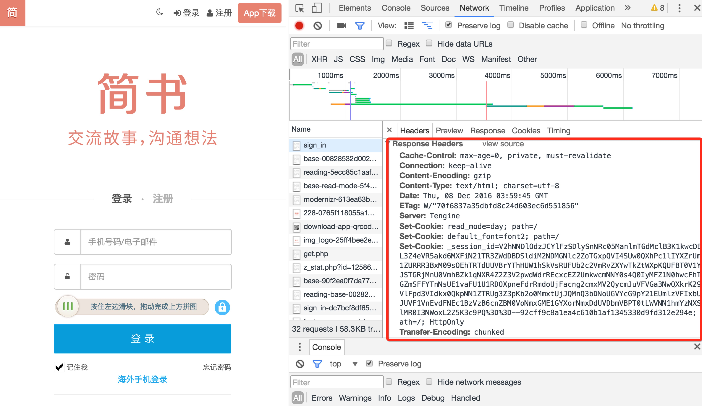
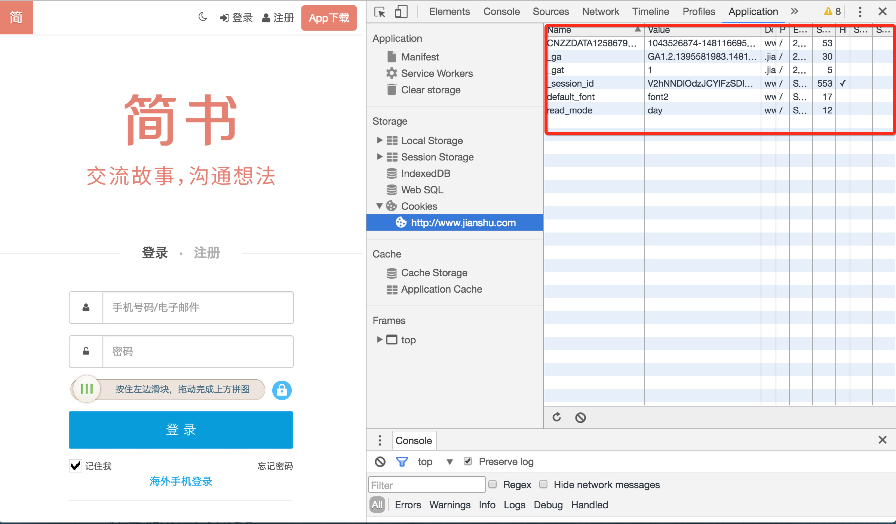
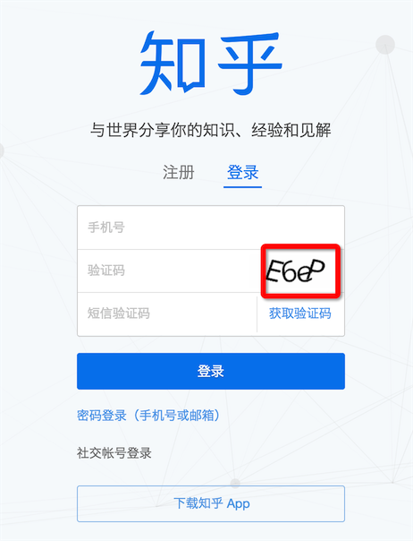

# node爬虫进阶之——登录

> 在之前的文章[node入门场景之——爬虫](http://www.jianshu.com/p/e05436dd8bdc)已经介绍过最简单的node爬虫实现，本文在原先的基础上更进一步，探讨一下如何绕过登录，爬取登录区内的数据

## 目录
- [理论基础](#1)
    + [如何维持登录态](#1.1)
    + [浏览器是怎么做的](#1.2)
- [node实现](#2)
    + [访问登录接口获取cookie](#2.1)
    + [请求登录区内接口](#2.2)
- [如果有验证码怎么破](#3)
- [延伸](#4)
- [总结](#5)

## 一、理论基础
### 如何维持登录态

http作为一种无状态的协议，客户端和服务器端之间不会保持长连接。在一个一个相互独立的请求响应之间，服务器如何识别哪些接口是来自同一个客户端？聪明的你，很容易想到如下一种机制：


这种机制的核心在于会话id（sessionId）：
1. 当客户端请求服务器端的时候，服务端判断该客户端没有传入sessionId，好的，这家伙是新来的，给它生成一个sessionId，存入内存，并把这个sessionId返回客户端
2. 客户端拿到服务器端的sessionId保存在本地，下次请求的时候带上这个seesionId，服务器检查内存是否存在这个sessionId(**如果在之前的某个步骤，用户访问了登录接口，那么此刻内存中已经以seesionId为key，用户数据为value保存在了内存中**)，服务器就可以根据sessionId这个唯一标识，返回该客户端对应的数据
3. 无论是客户端还是服务器端丢失了这个sessionId都会导致前面的步骤重新来过，谁也不认识谁了，重新开始

> 首先客户端通过sessionId和服务器端建立一种关联，然后用户再通过客户端与服务器端建立一种关联（sessionId与用户数据的键值对），从而维持了登录态

### 浏览器是怎么做的
> 实际上，浏览器是不是按照上述的机制设计的呢？还真是！



这其中浏览器做了哪些事情：
一、 浏览器在每一次http请求中，都会在http的请求头中加上该请求地址域名对应的cookie（如果cookie没有被用户禁用的话），在上图中，第一个次请求服务器请求头中同样有cookie，只是cookie中还没有sessionId
二、 浏览器根据服务器响应头中的Set-Cookie设置cookie，为此，服务器会将生成的sessionId放入Set-cookie中
> 浏览器接收到Set-Cookie指令，就会以请求地址的域名为key设置本地cookie，一般情况下，服务器在返回Set-cookie的时候，对sessionId的过期时间默认设置为浏览器关闭时失效，这就是浏览器从打开到关闭就是一次会话的由来（有些网站还可以设置保持登录，设置cookie长时间不失效尔尔）

三、 当浏览器再次向后台发起请求时，此时请求头中的cookie已经包含了sessionId，如果在此之前用户已经访问过登录接口，那么就已经可以根据sessionId来查询到用户数据了

口说无凭，下面就以简书为例说明：
1. 首先用chrome打开简书的登录页面，在application中找到http://www.jianshu.com下的所有cookie，进入Network项中把preserve log勾选上（不然页面发生了重定向之后将无法看到之前的log）

2. 然后刷新页面，找到sign-in接口，它的响应头中有很多Set-Cookie有木有

3. 再去查看cookie的时候，session-id已经保存好了，下次再去请求简书的其它接口的时候（例如获取验证码、登录），都会带上这个session-id，登录后用户的信息也会跟session-id关联起来


## 二、node实现
> 我们需要模拟浏览器的工作方式，去爬去网站登录区内的数据
> 找了一个没有验证码的网站进行试验，有验证码的又要涉及到验证码识别（简书的登录就不考虑了，验证码复杂程度感人），下节说明
### 访问登录接口获取cookie

```
    // 浏览器请求报文头部部分信息
    var browserMsg={
        "User-Agent":"Mozilla/5.0 (Macintosh; Intel Mac OS X 10_10_5) AppleWebKit/537.36 (KHTML, like Gecko) Chrome/54.0.2840.71 Safari/537.36",
        'Content-Type':'application/x-www-form-urlencoded'
    };

    //访问登录接口获取cookie
    function getLoginCookie(userid, pwd) {
        userid = userid.toUpperCase();
        return new Promise(function(resolve, reject) {
            superagent.post(url.login_url).set(browserMsg).send({
                userid: userid,
                pwd: pwd,
                timezoneOffset: '0'
            }).redirects(0).end(function (err, response) {
                //获取cookie
                var cookie = response.headers["set-cookie"];
                resolve(cookie);
            });
        });
    }
```

1. 需要现在chrome下捕获一次请求，获取一些请求头的信息，因为服务器可能会对这些请求头信息进行校验。例如，在我实验的网站上，起初我并没有传入User-Agent，服务器发现并不是来自服务器的请求，返回了一串错误信息，所以我之后设置User-Agent，把自己伪装成chrome浏览器了~~

2. [superagent](https://github.com/visionmedia/superagent)是一个 client-side HTTP request库，使用它可以跟轻松的发送请求，处理cookie(自己调用http.request在操作header字段数据上就没有这么方便，获得set-cookie之后，还得自己拼装成合适的格式cookie)。redirects(0)主要是设置不进行重定向

### 请求登录区内接口
```
    function getData(cookie) {
        return new Promise(function(resolve, reject) {
            //传入cookie
            superagent.get(url.target_url).set("Cookie",cookie).set(browserMsg).end(function(err,res) {
                var $ = cheerio.load(res.text);
                resolve({
                    cookie: cookie,
                    doc: $
                });
            });
        });
    }
```

在上一步中拿到set-cookie之后，传入getData方法，在通过superagent设置到请求当中（set-cookie会格式化成cookie）,就可以正常拿到登录去内的数据
> 在实际的场景中，未必会如此顺利，因为不同的网站有不同的安全措施，例如：有些网站可能需要先请求一个token，有些网站需要对参数进行加密处理，有些安全性更高的，还有防重放机制。在定向爬虫中，这需要具体的去分析网站的处理机制，如果绕不过去，就适可而止吧~~
> 但是对付一般内容资讯类的网站还是够用的

通过以上方式请求到的只是一段html字符串，这里还是老办法，使用cheerio库将字符串载入，就可以拿到一个类似于jquery dom的对象，就可以像jquery一样去操作dom，这真的是一个神器，良心制作！

## 三、如果有验证码怎么破
现在不需要输验证码就可以登录的网站还有几个？当然我们就不企图去识别12306的验证码了，简书这种良心之作验证码也不奢望了，像知乎这种too young too simple的验证码还是可以挑战下的


Tesseract 是google开源的OCR识别工具，虽然跟node没有什么关系，但是可以用node来调度使用，具体使用方式：[用node.js实现验证码简单识别
](https://cnodejs.org/topic/56addaf524b0c1ec628ff0f6)

然而即便是使用graphicsmagick来对图片进行预处理，也不能保证有很高的识别率，为此还可以对tesseract进行训练，参考：[利用jTessBoxEditor工具进行Tesseract3.02.02样本训练，提高验证码识别率](http://www.cnblogs.com/zhongtang/p/5555950.html)

能不能做到高识别率，就看人品了~~~

## 四、延伸
还有一种更简单的方式去绕过登录态，就是使用PhantomJS，phantomjs是一个基于webkit开源的服务器js api，可以认为它就是一个浏览器，只是你可以通过js脚本来操控它。

由于其完全模拟浏览器的行为，所以你根本不需要关心set-cookie,cookie的事情，只需要模拟用户的点击操作就可以了（当然如果有验证码，还是得去识别的）

这种方式也并非毫无缺点，完全模拟浏览器的行为，意味者不放过任何一个请求，需要载入可能你并不需要的js、css、图片的静态资源，需要点击多个页面才能到达目的页面，在效率上要比直接访问target url要低

> 感兴趣自行搜索`phontomJS`


## 五、总结
虽然说的是node爬虫的登录，但是前面原理讲了一大堆，目的是如果你想换一种语言实现，也可以游刃有余，还是那句话：理解原理很重要

欢迎留言讨论，如果对您有帮助，请留个赞~~


