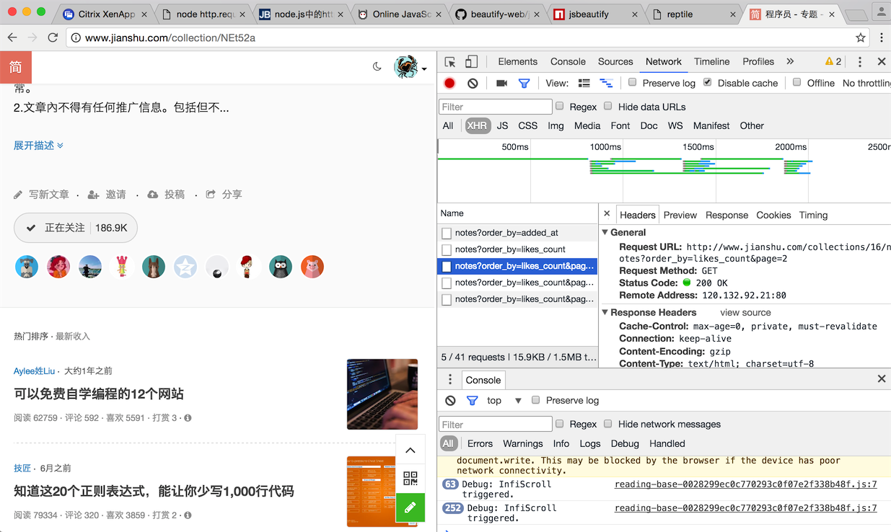
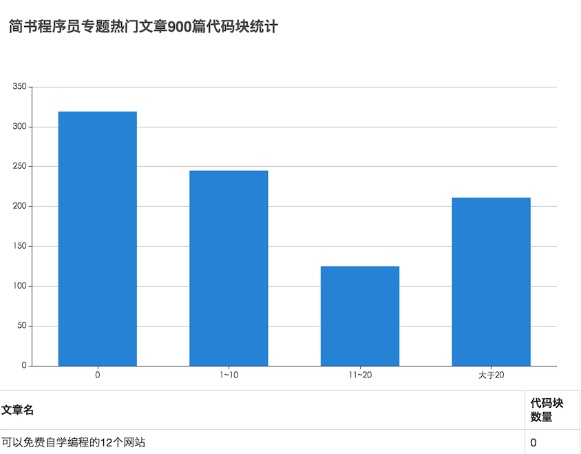

# node入门场景之——爬虫
> 边做边学效率更高，爬虫是node的适用场景之一
> 为了验证“***经验总结、资料归集类技术文章更容易上热榜***”的猜想，可以做一个爬虫：爬取简书程序员专题热门文章前999篇，统计每篇文章的代码块数量（为什么是统计代码块数量，对于人来说，通过一篇文章的标题内容来判断文章的类型是一件轻而易举的事，然而对于计算机来说，这却是一件困难的事情，这已经属于人工智能的范畴了。然而获取文章的代码块数量对于计算机来说就容易得多了，可以认为，代码块为0或者较少的文章，属于经验类文章，代码块数量较多的文章如果不是资料归集的话，多半就属于谈源码实现的了）

## 目录
- [知识点](#1)
- [实现步骤](#2)
    + [拉取页面列表](#2.1)
    + [拉取页面详情，分析统计](#2.2)
    + [生成统计页面](#2.3)
- [总结](#3)

<h2 id='1'>知识点</h2>
1. http.request：node http模块的request方法可以作为http client向服务器发起http请求，爬虫需要向目标链接发起http请求来获得页面信息
2. cheerio：通过http请求到的页面信息，由于缺乏浏览器的dom解析，看起来就是一段凌乱的字符串，实在糟糕。好在我们可以使用cheerio库将其解析为dom，这样我们就可以使用类似jquery的语法去分析页面信息
3. promise：由于node单线程的特性，不可避免的需要用到大量异步编程的写法，层层嵌套的回调写法已经low了，来试试promise的写法

<h2 id='2'>实现步骤</h2>
<h3 id='2.1'>拉取页面列表</h3>
首先需要拿到程序员专题热门列表的请求链接

ajax请求，需要使用chrome dev tools，拉到底部还能加载更多：
```
//order_by=likes_count 表示按照热门进行排序
//page是分页参数，每页9条，我们可以通过改变page=0~100来拉取900篇文章
http://www.jianshu.com/collections/16/notes?order_by=likes_count&page=2
```

下一步通过这个链接拉取列表数据
```
    /**
     - 创建promise
     */
    Seek.prototype.createPromise = function(i) {
        var options = {
            url: 'http://www.jianshu.com/collections/16/notes?order_by=likes_count&page=' + i,
            type: 'get'
        }
        return new Promise(function(resolve, reject) {
            options.callback = function(data, _setCookie) {
                resolve(data);
            }
            request(options, null);
        });
    }

```
可以创建一个promise对象来发起request请求（request的封装就不贴出来了，实验证明，代码块太多的文章不容易上热榜~~）

起初我的做法是同时创建拉取1~100页数据的100个promise对象，同时异步的发起100个request请求，然而这样的做法会有几十个请求请求失败（兴许是简书那边做了限制），所以，还是耐心点，每次发起5个请求，直到100页都请求成功
```
    /**
     * 递归的请求，每次并发的请求5个
     */
    Seek.prototype.seek = function(callback) {
        var self = this;
        times++;
        var ot = times;
        var promise = Promise.all([
            self.createPromise(times),
            self.createPromise(++times),
            self.createPromise(++times),
            self.createPromise(++times),
            self.createPromise(++times)
        ]);
        promise.then(function(result) {
            console.log("seekList totals:" + times);
            pages = pages.concat(result);
            if (times < totalPage) {
                self.seek(callback);
            } else {
                callback(pages);
            }
        });
    }
```

拿到所有的列表数据之后，就可以使用cheerio库来分析列表页面，抓取文章详情链接(在这一步之前你同样需要使用chrome dev tools工具分析页面结构)
```
    /**
     * 使用cheerio载入列表页面
     */
    Analyse.prototype.load = function(data, i) {
        return new Promise(function(resolve, reject) {
            var $ = cheerio.load(data);
            var pages = [];
            var els = $('.article-list li');
            if(els.length === 0) {
                console.warn('load error page:' + i );
                resolve([]);
            }
            els.each(function(index) {
                if ($(this).attr('class') === 'have-img') {
                    pages.push($(this).children('a').attr('href'));
                } else {
                    pages.push($(this).children('div').children('.title').children('a').attr('href'));
                }
               
                if(index === els.length - 1) {
                    resolve(pages);
                }
            });
        });
        
    }
```

<h3 id='2.2'>拉取页面详情，分析统计</h3>
从上一步中拿到900篇热门文章的地址之后，需要再次去抓取文章详情页面，同样的每次查5篇，使用chrome dev tools分析得知，简书文章的代码块使用的都是`<code></code>`标签，统计此标签出现的数量就可以了
```
    /**
     * 创建promise
     */
    Seek.prototype.createPromise = function(url) {
        var options = {
            url: 'http://www.jianshu.com' + url,
            type: 'get'
        }
        return new Promise(function(resolve, reject) {
            options.callback = function(data, _setCookie) {
                var $ = cheerio.load(data);
                //页面标题
                var title = $('h1.title').text();
                //代码块数量
                var codes = $('code').length;
                if(codes === 0) {//代码块为0的总数
                    zeroCount++;
                } else if(codes <= 10) {//代码块为<=10的总数
                    oneToTen++;
                } else if(codes <= 20) {//代码块<=20的总数
                    elToTwo++;
                } else {//代码块>20的总数
                    beyondTwo++;
                }
                resolve({
                    title: title,
                    codes: codes
                });
            }
            request(options, null);
        });
    }
```
<h3 id='2.3'>生成统计页面</h3>
数据总需要一个展示的地方，使用nunjucks作为页面模板，注入抓取到的数据，在使用echarts生成统计图表，就是这个feel，[结果页面](https://zengwenfu.github.io/jian-analyse/app/views/)


<h3 id='3'>总结</h3>
开发爬虫是一件很酷的事情，在这个过程中还能学到知识，提升学习兴趣，从爬虫做起~~
[源码](https://github.com/zengwenfu/jian-analyse)

欢迎留言讨论，如果对您有帮助，请留个赞~~


