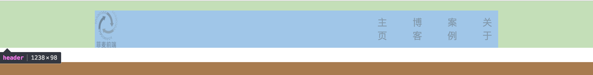

# 任务一
## 问题
1) 有点滥用flex：我们的任务是通过这个作业来训练flex，但是从整体网页结构来说的话，body设置为flex似乎并无必要（实际上现在你设置了也没有发挥作用），所以在布局之前要对网页有整体的构思     
> 我们作业的目的是为了联系flex，因为这是目前比较先进的布局方式，所以会刻意要求，但是真正使用的时候还是要权衡的    

2）考虑不够周全：且看下图

header处设置了一个固定的padding，当屏幕缩小的时候，header就被挤爆了，就出现了上图的情况
> 如果不考虑手机端适配，传统的pc是给内容一个适当的（大部分pc屏幕能显示完，如960）的宽度，让其居中

3) flex理解得不够透彻，那两篇教程文章还得仔细专心看：header处，一左一右竟然还是通过margin-left来做的（不是不可以用，而是还有没有更简单的方式可以实现），要知道justify-content: space-between就可以搞定啊
> flex的目的是让布局变得简单，还需要好好理解

## 亮点
尝试提取公共的样式，这个需要点赞，不知道你有没有使用过css预处理语言如less、sass，后续这一块可以有更好的尝试

## 总结
有一定基础，flex理解不够透彻

