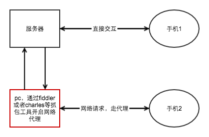
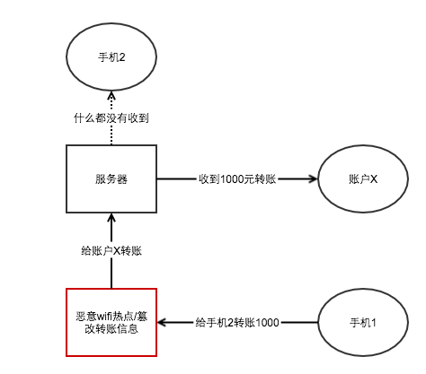

# 用抓包工具来告诉你，为什么不能随随便便连接不明wifi
> 没记错的话，连新闻联播都报道过，在外面不能随随便便的连接陌生的wifi，特别是涉及支付的环节
> 今天咱们就用抓包工具的工作方式，来谈谈这里面的缘由

## 抓包工具的工作方式

前端开发的同学（包括android、ios和h5）对抓包工具应该不陌生，作为开发调试工具，尤其是在解决生产环境bug上面，抓包工具往往能大显神威

抓包的工具的配置上（大概是这几个步骤，具体每种工具可能还有更多细节）：
1. 首先在pc上安装抓包工具（例如mac上安装charles）
2. 保证手机跟pc连接了同一wifi(或者让手机连接pc开启的热点)
3. 设置手机HTTP代理为电脑的ip和端口

如此手机上发起的任何http请求以及服务器的响应信息，都能被pc上的抓包工具截获。开发可以拿到请求和响应信息定位bug，还可以通过替换响应的资源文件（如js文件）来调试bug。

## 依此原理，如果连接了恶意的wifi会怎样
倘若你连接了不明的恶意wifi热点，那么很有可能在路由节点走了别人的代理，那么你的每一次http请求响应信息都有可能被截获篡改

如图所示，假若你的本意是从*手机1*转账1000元到*手机2*，然而你不小心连接了一个而已的wifi热点，wifi热点截获了你的转账信息，篡改了转账请求，将钱转到了*账户X*，就在你乐滋滋的以为钱已经成功转出去了的时候，盗匪已经逃之夭夭了

## 总结
天下没有免费的午餐，不明的免费wifi还真的不一定值得拥有，至少在涉及钱的方面，要足够留心

