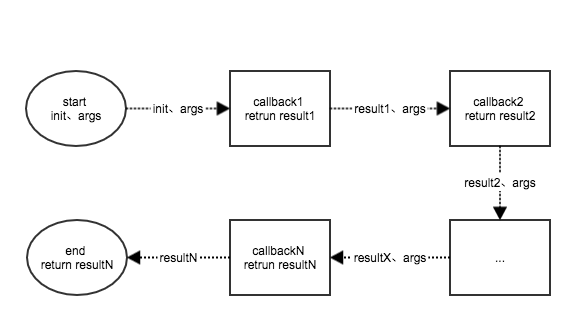

# Tapable中文文档
>非直译，加入了一些自己的理解，[原文](https://github.com/webpack/tapable)

## Tapable
```
    var Tapable = require("tapable");
```
`Tapable`是一个用于事件发布订阅执行的插件架构

在使用上，你仅仅需要继承它
```
    function MyClass() {
        Tapable.call(this);
    }

    MyClass.prototype = Object.create(Tapable.prototype);

    MyClass.prototype.method = function() {};
```
或者复制它的属性到你的类中
```
    function MyClass2() {
        EventEmitter.call(this);
        Tapable.call(this);
    }

    MyClass2.prototype = Object.create(EventEmitter.prototype);
    Tapable.mixin(MyClass2.prototype);

    MyClass2.prototype.method = function() {};
```

## 公开的方法
### apply 
```
    void apply(plugins: Plugin...)
```
通过arguments获得所有传入的插件对象，并调用插件对象的apply方法，注册插件（所以，一个合法的插件应该包含入口方法apply）
### plugin
```
    void plugin(names: string|string[], handler: Function)
```
事件绑定函数，参数说明
`names`: 需要监听的事件名称，可以传入事件名称集合（同时绑定多个事件），也可以传入单个事件名称
`handler`: 事件的处理函数

## 受保护的方法
### applyPlugins
```
    void applyPlugins(name: string, args: any...)
```
触发事件`name`，传入参数`args`，并行的调用所有注册在事件`name`上的处理函数

### applyPluginsWaterfall
```
    any applyPluginsWaterfall(name: string, init: any, args: any...)
```
触发事件`name`，串行的调用注册在事件`name`上的处理函数（先入先出），最先执行的处理函数传入init和args，后续的处理函数传入前一个处理函数的`返回值`和args，函数最终返回最后一个处理函数的返回结果

### applyPluginsAsync
```
    void applyPluginsAsync(
        name: string,
        args: any...,
        callback: (err?: Error) -> void
    )
```
触发事件`name`，串行的调用注册在事件`name`上的处理函数（先入先出），倘若某一个处理函数报错，则执行传入的`callback(err)`，后续的处理函数将不被执行，否则最后一个处理函数调用`callback`。

插件注册此类事件，处理函数需要调用callback，这样才能保证监听链的正确执行
```
    var myPlugin = function() {

    }
    myPlugin.prototype.apply(tapable) {
        tapable.plugin('name', function(arg1, arg2, arg3, callback)) {
            //do something
            ...
            //调用callback
            callback();
        }
    }
```
### applyPluginsBailResult
```
    any applyPluginsBailResult(name: string, args: any...)
```
触发事件`name`，串行的调用注册在事件`name`上的处理函数（先入先出），传入参数args，如果其中一个处理函数返回值`!== undefined`，直接返回这个返回值，后续的处理函数将不被执行

### applyPluginsAsyncWaterfall
```
    applyPluginsAsyncWaterfall(
        name: string,
        init: any,
        callback: (err: Error, result: any) -> void
    )
```
触发事件`name`，串行的调用注册在`name`上的处理函数(先入先出)，第一个处理函数传入参数`init`，后续的函数依赖于前一个函数执行回调的时候传入的参数`nextValue`，倘若某一个处理函数报错，则执行传入的`callback(err)`，后续的处理函数将不被执行，否则最后一个处理函数调用`callback(value)`

插件注册此类事件，处理函数需要调用callback(err, nextValue)，这样才能保证监听链的正确执行
```
    var myPlugin = function() {

    }
    myPlugin.prototype.apply(tapable) {
        tapable.plugin('name', function(arg1,..., argx, callback)) {
            //do something
            ...
            //调用callback
            var args = Array.prototype.slice.call(arguments, 1);
            var callback = args.pop();
            callback(null, value);
        }
    }
```

### applyPluginsAsyncSeries
```
    applyPluginsAsyncSeries(
        name: string,
        args: any...,
        callback: (err: Error, result: any) -> void
    )
```
这个方法同`applyPluginsAsync`

### applyPluginsParallel
```
    applyPluginsParallel(
        name: string,
        args: any...,
        callback: (err?: Error) -> void
    )
```
触发事件`name`，传入参数`args`，并行的调用所有注册在事件`name`上的处理函数，倘若任一处理函数执行报错，则执行`callback('err')`，否则当所有的处理函数都执行完的时候调用`callback()`

同样的，插件注册此类事件的时候，回调函数要执行callback

### applyPluginsParallelBailResult
```
    applyPluginsParallelBailResult(
        name: string,
        args: any...,
        callback: (err: Error, result: any) -> void
    )
```
触发事件`name`，串行的执行注册在事件`name`上的处理函数（先入先出），每个处理函数必须调用`callback(err, result)`，倘若任一处理函数在调用`callback(err, result)`的时候，`err!==undefined || result!==undefined`，则`callback`将真正被执行，后续的处理函数则不会再被执行。 


