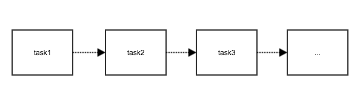
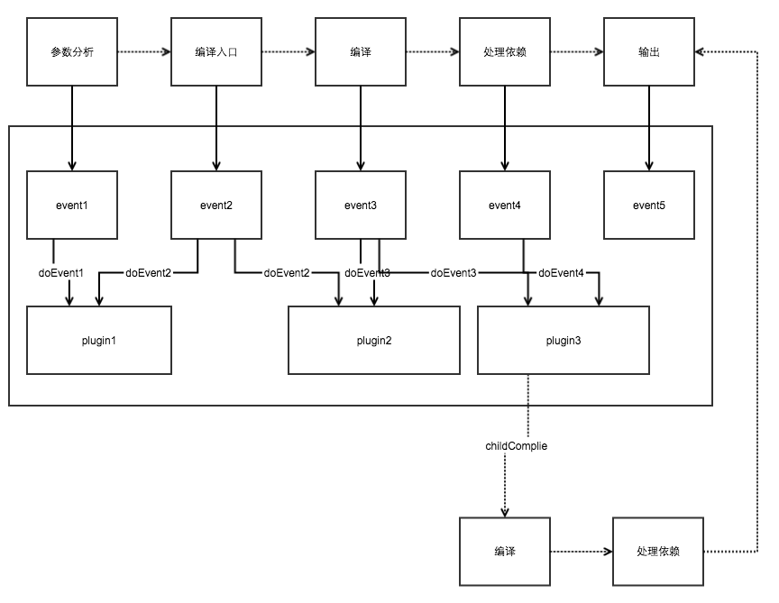

# webpack不适合多页面应用？你写的插件还不够多
> webpack不适合多页面应用？想必你听过很多这样的论断，也看到过gulp+webpack结合使用的方式，这不过是无奈之举，因为目前webpack可用的插件实在太少，自己写起来门槛又太高，相比之下，gulp要灵活自如不少
> 插件才是webpack的灵魂，用它就用它的灵魂，跳出自己的思维舒适区吧

## 目录
- [为什么说webpack不适合多页面应用](#1)
- [没有就写一个呗](#2)
- [怎样写这个插件](#3)
    + [查文档](#3.1)
    + [webpack设计思想](#3.2)
    + [html-webpack-plugin分析](#3.3)
    + [改造之路](#3.4)
- [后话](#4)


## <h2 id='1'>为什么说webpack不适合多页面应用</h2>
其实最主要的原因就是找不到适合处理多个html模板的插件:

- 对于react，webpack跟它是天生融合的，因为react本身就承担了web应用的view层，作为js它干了本该由html干的事情，html只需要提供一个容器引入生成的bundle.js文件，根本不需要关注html需要如何处理的问题
- 对于单页面应用，情况也大体类似，js承担了很多页面渲染的工作，如果说唯一的入口html还需要处理的话，可以使用html-webpack-plugin插件，它可以生成一个html，注入所有生成的js文件(如果使用了extract-text-webpack-plugin的话还会包括所有的css文件)，对于body中的内容，可以传入模板和解析模板的loader
- 对于多页面应用，情况就稍显复杂了。对不同的页面单独新建一个html-webpack-plugin，并且传入不同的模板，通过参数chunks和excludeChunks来过滤html模板文件需要注入的实体，这是一个方法，但不是一个好方法。开发人员在开发html文件的时候需要转移掉太多注意力了，这不是一个优秀的开发框架的特点。于是就出现了曲线救国的方法，webpack不将html模板纳入管理范围，交由gulp来解析搬运html。这种看似皆大欢喜的解决办法实属无奈，对于html中的外链（js、css和图片），如果我们打包结果加上了hash值，为了html的引用正确，还得进行非常耗时的遍历判断替换。

## <h2 id='2'>没有就写一个呗</h2>
为了处理多页面应用，我们需要这样一个插件：

1. 配置一个模板路径（templatePath），插件就可以自动找到该目录下所有的html模板，准备解析
2. 可以配置解析模板的加载器（loader），用于解析模板文件，非必传，在module.loaders中配置同样有效
3. 可以配置模板的后缀（templateSuffix），用于过滤模板路径下的非模板文件
4. 可以配置需要过滤的文件（ignore），有些公用的模板，例如header和footer，只是用来引用的，不需要输出成单独的html文件，这个也是需要过滤掉的
5. 可以配置html文件的输出路径(path)
6. 还要提供一套规则来引用生成的css和js，使用##entry.[name].css/js##的方式来引用，name为entry配置项中的key值，js用于js文件，css用于css文件，匹配失败则不做替换
```
    //css的引用
    <link rel="stylesheet" type="text/css" href="##entry.demo.css##">

    //js的引用
    <script type="text/javascript" src='##entry.demo.js##'></script>
```


## <h2 id='3'>怎样写这个插件</h2>
### <h3 id='3.1'>一、查文档</h3>
并没有太多人愿意去写一个webpack-plugin，Because why?
当你打开webpack的官方文档[how to write a plugin](https://github.com/webpack/docs/wiki/how-to-write-a-plugin)的时候，就在第一段，有一句话特别醒目:
>Plugins expose the full potential of the Webpack engine to third-party developers. Using staged build callbacks, developers can introduce their own behaviors into the Webpack build process. Building plugins is a bit more advanced than building loaders, because you'll need to understand some of the Webpack low-level internals to hook into them. **Be prepared to read some source code!**

没错你得做好阅读源码的准备，看到这里，很多同学已经失去了继续下去的勇气！
however，这个文档还是要读下去的，英文不好的话，网上还有译文以及各种分析资料，这篇文档的信息量并不多，我觉得最关键的概念就几个：

- 两个重要的对象，compiler和compilation，所有的插件操作都要基于这两个对象，so，文档建议你去读它们的源码
- compilation.modules，每一个资源文件都会被编译成一个模块（module），module.fileDependencies记录了模块依赖的其它模块，例如：index.js通过require('./index.css')引入了index.css，那么inde.js模块的依赖项里面就包含了index.css模块
- compilation.chunks，就是entry的每个配置项，chunk.modules，entry每个配置项所包含的模块以及模块所依赖的模块，chunk.files，每个配置项最后的输出结果文件，这里的值可以从compilation.assets获得
- compilation.assets，整个打包流程最终要输出的文件

然而，读完整个文档，还是无法写出满足我们需求的插件，看来必须要走出自己的思维舒适区，去读源码了，读别人的源码的要诀是理解别人的设计思想

### <h3 id='3.2'>二、webpack的设计思想</h3>
要说明webpack的设计思想，有必要拿gulp的处理流程来进行对比
gulp处理流程：

webpack处理流程：


gulp的处理流程很好理解，一个个串行的task，处理完成数据流往下传输，下一个task接着处理，整个处理流程是**面向过程**的

webpack把各种资源都当成模块，处理模块之间的依赖关系，合并输出，不同于gulp串行的task链的伸缩性，它是有**固有的生命周期的**，上图中`参数分析->编译入口->编译—>处理依赖->输出`用了虚线，因为这只是其中的主要环节，webpack的环节可远不止这些。webpack核心使用了[Tapable](https://github.com/webpack/tapable)实现事件的发布订阅处理的插件架构，对于固有生周期的每一个环节，都会抛出对应的事件提供插件切入，这是一种**面向切面**的思想，每一个插件可以切入多个事件点，对于每个事件点背后的处理逻辑（如event2: plugin1.doEvent2、plugin2.doEvent2 ），可以独立运行，也可以有一定的依赖，插件有太多情况，图中并不能完全表达
特别的，在插件中还可以创建子编译流程，它可以像主流程一样去编译解析。

>gulp只是定义了一系列流的管道，而webpack已经做好了一个分析编译打包输出的完整流程，同时通过插件机制，让你可以在流程的方方面面进行切入，除了写插件的门槛比较高，webpack在灵活性上并不输于gulp

*具体webpack在哪个环节抛出了什么事件，后面我再总结分析，敬请关注*

OK，理解了整个工作过程，再去读源码，就不用这么迷茫了

### <h3 id='3.3'>三、html-webpack-plugin分析</h3>
倘若等到把webpack的每个细节搞得清清楚楚（有空的时候去还是有必要去读这优秀的代码，受益匪浅），再去着手写这个插件，未免用劲太蛮，最精准狠的办法是找一个接近的插件，先读懂它，再改造它，没错这个插件就是html-webpack-plugin。
过程就比较曲折了，不过效果是可观的：

- 插件的重要参数（参数都不是必传的，而且有很多参数，我们是在分析它的运行机制，不是分析如何使用，就不一一列举了）：
    + filename: 输出文件名，默认index.html
    + template: html模板以及处理模板的loader，不传则默认使用一个叫做default_index.ejs的模板，以及默认的loader.js进行模板解析，这个模板就是一个空的html。
- 插件监听了make事件，也就是在主流程分析入口文件，准备生成模块文件之际，插件创建了一个子编译流程，专门编译template，并输出成filename。这个子编译进程相对于主流程来说是异步处理的，所以主流程为期创建了一个promise，以便接收其处理完成的通知
- 插件还监听了emit事件，也就是马上要通过compilation.assets输出文件了，这个时候插件还有最后的机会改变输出结果
    + 还是得等待子编译进程的完结
    ```
    Promise.resolve()
      // Favicon
      .then(function () {
        if (self.options.favicon) {
          return self.addFileToAssets(self.options.favicon, compilation)
            .then(function (faviconBasename) {
              var publicPath = compilation.options.output.publicPath || '';
              if (publicPath && publicPath.substr(-1) !== '/') {
                publicPath += '/';
              }
              assets.favicon = publicPath + faviconBasename;
            });
        }
      })
      // Wait for the compilation to finish
      .then(function () {
        //这一步就是等待compilationPromise的处理结果
        return compilationPromise;
      })
      .then(function (compiledTemplate) {
        // Allow to use a custom function / string instead
        if (self.options.templateContent) {
          return self.options.templateContent;
        }
        // Once everything is compiled evaluate the html factory
        // and replace it with its content
        return self.evaluateCompilationResult(compilation, compiledTemplate);
      })
    ```
    + 接下来对编译结果进行进一步的处理，注入生成的js和css文件（chunks），当然是否注入，注入哪些文件可以通过参数控制
    + 最后，将处理的结果，放入compilation.assets中，输出html文件

这其中的很多步骤，都还同时抛出了事件，以便别的插件进行监听，例如：
```
    // Allow plugins to make changes to the assets before invoking the template
      // This only makes sense to use if `inject` is `false`
      //在马上要生成html文件的阶段，抛出了html-webpack-plugin-before-html事件
      .then(function (compilationResult) {
        return applyPluginsAsyncWaterfall('html-webpack-plugin-before-html-generation', {
          assets: assets,
          outputName: self.childCompilationOutputName,
          plugin: self
        })
        .then(function () {
          return compilationResult;
        });
      })
```

### <h3 id='3.4'>四、改造之路</h3>
通过上节的分析，可以开启我们漫漫的改造之路了

1. 首先，我们需要的是可以处理多个模板，那么我们应该传入模板所在的路径，如果有需要还可以传入模板后缀，以及需要排除的文件，对路径下的模板进行过滤，所以第一件事情，我们要写一个遍历目录下所有模板文件的方法，如果传入了输出相对目录path，还需要对文件名进行下处理
```
    //后缀过滤
    if (!suffix || filePath.indexOf(suffix) >= 0) {
        var key = filePath.substring(dirname.length + 1);
        //ignore过滤
        if(!ignore || ignore.indexOf(key) < 0) {
            //生成的文件名处理
            if (!suffix && key.indexOf('.html') >= 0) { //默认过滤掉.html
                key = key.substring(0, key.indexOf('.html'));
            } else if (!!suffix) {
                key = key.substring(0, key.indexOf(suffix));
            }
            if (!!outputPath) {
                key = outputPath + '/' + key;
            }
            //fileJson相当于webpack.config.js中的entry配置，
            //要传入子编译进程进行编译的
            fileJson[key] = filePath;
        } 
    }
```
2. 同样的，我们需要一个子编译进程，根据我们传入的loader，对模板文件进行解析，之前的子编译进程只需要处理一个文件，这时候我们需要稍稍改造下
```
    //html-webpack-plugin
    childCompiler.apply(
        new NodeTemplatePlugin(outputOptions),
        new NodeTargetPlugin(),
        new LibraryTemplatePlugin('HTML_WEBPACK_PLUGIN_RESULT', 'var'),
        //这个插件传入要处理的入口文件
        new SingleEntryPlugin(this.context, template), 
        new LoaderTargetPlugin('node')
    );

    //muti-html-webpack-plugin
    childCompiler.apply(
        new NodeTemplatePlugin(outputOptions),
        new NodeTargetPlugin(),
        new LibraryTemplatePlugin('HTML_WEBPACK_PLUGIN_RESULT', 'var'),
        //注释掉之前的处理插件
        // new SingleEntryPlugin(this.context, template),
        new LoaderTargetPlugin('node')
      );

      //定义一个增加插件的方法
       function itemToPlugin(item, name) {
          if(Array.isArray(item)) //如果entry项是数组，使用multiEntry处理
            return new MultiEntryPlugin(context, item, name);
          else
            return new SingleEntryPlugin(context, item, name);
        }

      //遍历我们传入的模板entries
      Object.keys(template).forEach(function(name) {
        childCompiler.apply(itemToPlugin(template[name], name));
      });
```
3. 同样主流程emit等待子编译流程的处理结果，对每一个模板的处理结果，匹配其中的```##entry.[name].js/css##```，替换成对应的chunks文件（精准的计算相对路径）
4. 将结果加入assets中，准备输出

## <h2 id='4'>后话</h2>
- [改造后插件：muti-html-webpack-plugin](https://github.com/zengwenfu/muti-html-webpack-plugin)
- [附带一个nunjucks解析器：compile-nunjucks-loader](https://github.com/zengwenfu/compile-nunjucks-loader)

    

