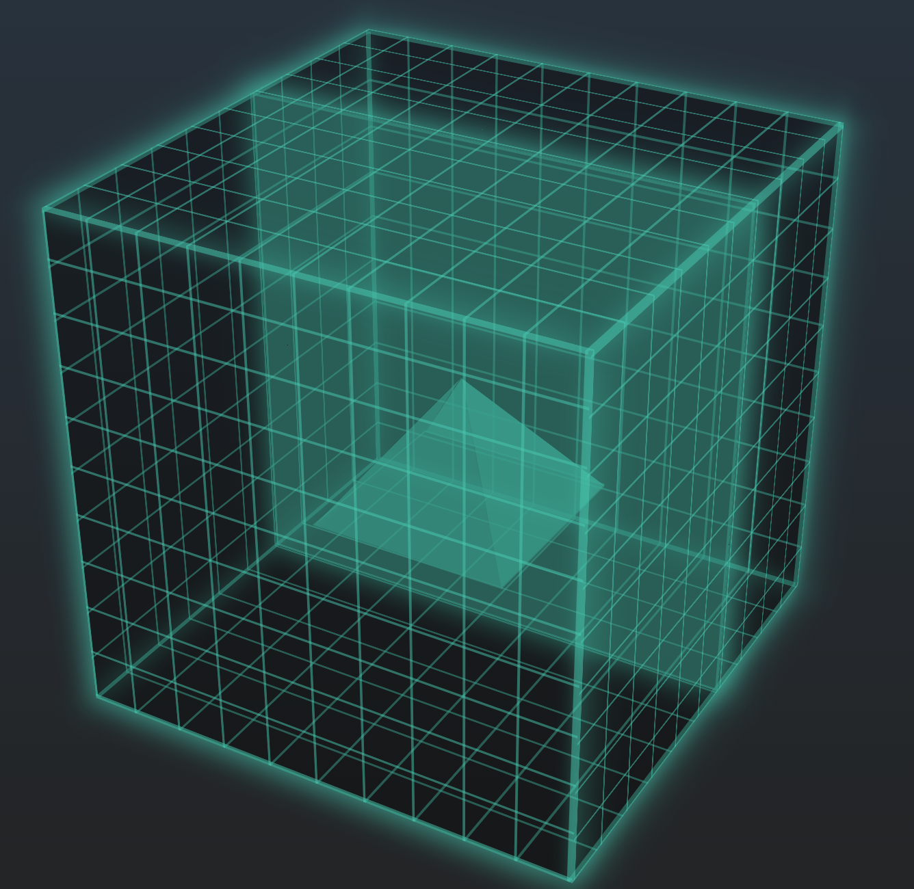

# 平安金融科技前端技术周报(第一期)
> **本期导读**: 2016作为VR虚拟现实的元年，VR内容将成为下一阶段的需求爆点。从前端的视角去看待接口合并，可能会有意想不到的效果，基于代理服务的接口合并方案，让接口更自由。点击穿透一直是移动端web开发的巨坑，理解成因，才能从容面对。文末再奉献两个精彩h5效果，欢迎赏鉴

## 原创专题
### 1) [敲黑板！揭开“VR APP开发”的神秘面纱](http://www.jianshu.com/p/c8d8f220cc27)@陈昱宏
2016作为VR虚拟现实的元年，各大VR厂商纷纷推出自己的硬件设备，巨头们建立自己的VR生态圈，推出各自的设备-平台-sdk为一体的闭环，随着VR硬件设备以及各大平台的推出完善，VR内容将成为下一阶段的需求爆点，VR开发也将成为IT热门职位。
### 2）[基于代理服务的接口合并方案](http://www.jianshu.com/p/07293e4825d0) @曾文富
过多的接口请求是web前端的主要性能瓶颈之一，接口合并是刚需。后台的接口设计有其既有粒度，对每个功能场景额外的增加合并的接口，工作量巨大，且场景难以覆盖。增加一台离接口服务器很近的代理服务器，定义一套接口合并的规则，代理服务器解析前端发来的规则，对接口服务器发起近距离请求，合并后返回。
### 3）[移动端click延迟及zepto的穿透现象](http://www.jianshu.com/p/14e736341b13)@严晓娥
穿透现象与click的延迟解决方法是分不开的，若要了解穿透现象，需要先了解click延迟的解决原理。

## 语言基础
### 1) [css3 animation 属性众妙](https://aotu.io/notes/2016/11/28/css3-animation-properties/)@燕婷
开发动画时，我们都是先根据视觉稿做好构建，再来给元素加动画的。如上文所述，可通过 animation-delay 来延迟的动画的执行。而在执行前，元素往往需要先隐藏（translate 定位到视窗外 / opacity 设置为 0 / scale 设置为 0 等）。若将隐藏元素的样式直接应用到元素上，一来不利于构建，二来对于不支持动画的浏览器来说，只会呈现一片空白。此时，animation-fill-mode 的 backwards 属性值便派上用场。

### 2) [保护客户端JavaScript应用最有效的方式](http://www.zcfy.cc/article/the-most-effective-way-to-protect-client-side-javascript-applications-1832.html)@度衡（译）
像Javascript的客户端技术中，存在许多有用的特色。这是造就了它为世界上最受欢迎的编程语言的原因。Javascript特色突出许多优点，其一便是即时编译。这有一些益处，比如，浏览器可以边下载内容边执行代码。不过，这种层次的自由也来了责任。

### 3）[使用CSS处理图像效果](http://www.w3cplus.com/css3/image-effects-with-css.html)@大漠
一直以来在大家的印象中，处理图像的效果都应该是设计师的工具，甚至这些事情应该都交给PhotoShop之类的设计软件来完成。但是随着CSS的技术发展以及浏览器更新，前端人员通过CSS也可以做一些图像的处理。今天就是想跟大家聊聊如何通过CSS来处理图像效果。

### 4）[前端开发者不得不知的ES6十大特性](http://www.alloyteam.com/2016/03/es6-front-end-developers-will-have-to-know-the-top-ten-properties/)@sheran
也许你还不知道ES6是什么, 实际上, 它是一种新的javascript规范。在这个大家都很忙碌的时代，如果你想对ES6有一个快速的了解，那么请继续往下读，去了解当今最流行的编程语言JavaScript最新一代的十大特性。

## 工具框架
### 1）[网页3D效果库Three.js初窥](http://www.cnblogs.com/leinov/p/threejs.html)@Leinov(译)
Three.js有几种不同的相机，现在我们使用PerspectiveCamera.第一个属性是视角，我们可以把相机理解为我们的眼睛, 第二个属性是宽高比，你通常希望使用元素的宽度除以高度，或者理解为当你在一个宽屏电视上看一个老电影是也会得到这种结果－图像会被拉伸，接下来的两个属性是远近剪切面，什么意思呢？字面上意思是：物体远离相机的far值或者比相机的near值还要近都不会被渲染! 看到这个我有点懵逼查了半天 投影矩阵 这篇文章讲的大概能看懂是什么意思。你现在不用担心这个，但是你可能会在你的app里使用其它值来达到更好的展现 ！

### 2) [Express入门教程：一个简单的博客](http://www.tuicool.com/articles/jueARjE)@nswbmw
Express 是一个简洁而灵活的 node.js Web应用框架, 提供了一系列强大特性帮助你创建各种 Web 应用，和丰富的 HTTP 工具。使用 Express 可以快速地搭建一个完整功能的网站，它有一套健壮的特性，可用于开发单页、多页和混合Web应用。此文介绍如何使用Express搭建多人博客。

### 3）[React构建单页应用方法与实例](http://www.cnblogs.com/luozhihao/p/5579786.html)@劳卜
React作为目前最流行的前端框架之一，其受欢迎程度不容小觑，从这门框架上我们可以学到许多其他前端框架所缺失的东西，也是其创新性所在的地方，比如虚拟DOM、JSX等。那么接下来我们就来学习一下这门框架是如何构建起一个单页应用的。

## 前端视界
> 点击链接可查看效果
### 1) [动感loading](http://www.pinganh5.com/showcase/57d270e4d1405d6e85915f79?showType=1)@陈昱宏

### 2) [摇钱树](http://www.pinganh5.com/showcase/58379ff35c45fbf230c5deb5?showType=1)@吴克炯

