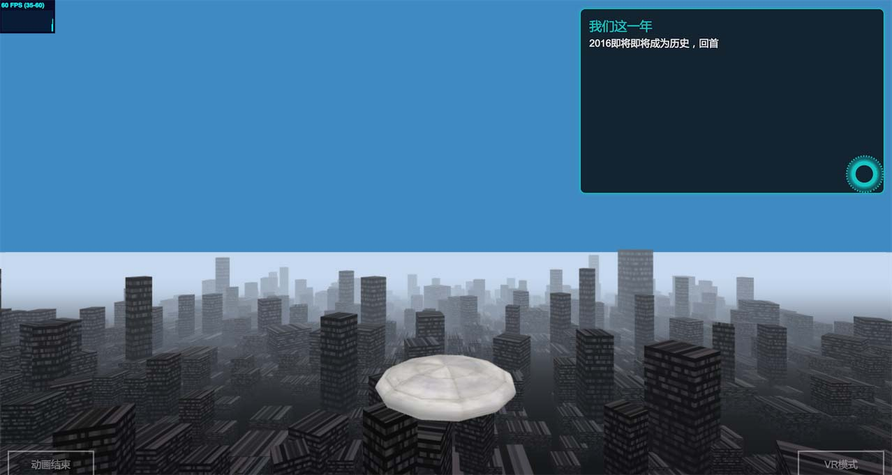

# 金融壹账通前端H5技术周报(第二期)
> **本期导读：**原创专题为大家带来两个css基本属性的深入理解、前端性能优化的三个级别以及可以提高编程兴趣的node爬虫实现。语言基础篇覆盖flex布局、js的类以及页面的高效适配等，值得细读。工具框架篇也带来了不少干货，2017年应该学习那些语言、框架和工具呢？最精彩的还是来自@昱宏的VR初探，文末*我们这一年*，欢迎赏鉴

## 原创专题
### 1）[css - vertical-align & line-height理解](http://www.jianshu.com/p/a88494ef825a)@严晓娥
vertical-align & line-height是css当中再基本不过的两个属性，也许你每天都在用，但是你是否足够了解它呢?
### 2）[前端性能优化的三个维度](http://www.jianshu.com/p/a5d9938ed60f)@曾文富
前端性能优化可以分为三个level：静态资源优化、接口访问优化、页面渲染速度优化，在操控门槛上依次递增，优化效果上越发没有这么明显，所以很多小团队只会做到了第一个level
### 3）[node爬虫进阶之——登录](http://www.jianshu.com/p/87867f325184)@曾文富
http作为一种无状态的协议，客户端和服务器端之间不会保持长连接。在一个一个相互独立的请求响应之间，服务器如何识别哪些接口是来自同一个客户端？

## 语言基础
### 1）[详解 flex-grow 与 flex-shrink](https://zhuanlan.zhihu.com/p/24372279)@谢燕
不得不感慨在 flex 之前 CSS 的布局功能之弱：基本只能使用一些并非为布局而设计的属性来实现想要的布局——float、inline-block、position、甚至是 table 等。而使用这些属性来实现各种布局效果，往往又会遇到相当多另外的坑：比如浮动的闭合、inline-block 的垂直对齐、position 的定位原点以及 table 的不够灵活等。
### 2）[Chrome出了个小bug：论如何在Chrome下劫持原生只读对象](https://zhuanlan.zhihu.com/p/24342684)@负羽
众所周知，虽然JavaScript是个很灵活的语言，浏览器里很多原生的方法都可以随意覆盖或者重写，比如alert。但是为了保证网页的安全性和网页制作者的一定控制权，有些浏览器对象是无法更改的，比如“window.location”对象，或者对它们的更改是无效的，比如”window.navigator”对象。然而，最近我发现Chrome出现了一个小“bug”，在Chrome 50+ 版本中，通过一些技巧可以轻易地重写这些对象，从而让恶意代码可以控制网页编写者的跳转行为。
### 3）[CSS技巧-rgba函数的妙用](http://zcfy.cc/article/the-power-of-the-rgba-color-function-in-css-css-tricks-2001.html)@谢于中 · 译
新出现的 CSS 颜色配置函数是一项非常有意思的功能，它给予我们在浏览器中直接操纵颜色的能力。例如，当鼠标悬停在按钮上时，可以使用color: color(black darkness(50%))改变颜色，而不需要使用 Sass 这类 CSS 预处理器。
### 4）[JavaScript写类的前世今生](https://jdc.jd.com/archives/2942)@snandy
JavaScript 从诞生至今已经走过了 20 年的历程。它的前世(1995~2015年)是一个长达 20 年没有类的世界，它的今生随着 2015 年 6 月 ES6 的发布迎来了有类的时代。JavaScript 从无“类”到有“类”，经历了从 ES1 到 ES6 的阶段。
### 5）[如何打造一个高效适配的H5](https://isux.tencent.com/how-to-make-webpage-fit-screen.html)@风聆
以往拿到一份视觉稿要做页面适配，通常都是针对不同分辨率尺寸做断点写 media query，然后看效果再微调。开发过程中视觉稿要是做了修改，修改的地方就得再走一遍分辨率测试和微调，这时想屎的心都有了。而且这些适配都是建立在已 知的分辨率尺寸库上，如果市面新出来一款分辨率尺寸机型，呵呵，又要奔跑在测试微调路上。是不是能有用一套代码就适应各种分辨率窗口，那么就不会再有上面 这些烦恼，且开发效率快和维护成本会降低很多。

## 工具框架
### 1）[2017 年你应该学习的编程语言、框架和工具](https://zhuanlan.zhihu.com/p/24369470)@IT程序狮 · 译
在过去的一年里，软件开发行业继续大踏步地向前迈进。回顾 2016 年，我们看到了更多新兴的流行语言、框架和工具，它们改变着我们的工作方式，让我们看到更多的可能。但在这个行业，紧随潮流是很难的。所以在每年年底，我们都会给你提供一些建议，它涉及什么是最重要的，以及你在未来一年中应该学习什么。
### 2）[初识 Dva](https://github.com/pigcan/blog/issues/2)@pigcan
近期，我们在内部做了一个类似 IDE 性质的应用，基于 electron 和 dva，由于之前一直只关注 node 相关的开发者工具，并未太多接触 React 等内容，所以这段时间过的有点煎熬同时也很兴奋，煎熬来源于非舒适区，而兴奋来源于发现基于 dva + electron 给开发者工具带来了更多的可能性。
### 3）[2016年前端技术观察](http://geek.csdn.net/news/detail/128912)@曹刘阳
这篇文章可能是火热的前端圈里，泼向很多技术的一盆冷水。我无意冒犯这些技术的传道者，文章只关乎技术，不关乎人。我对任何新技术于个人的成长都持肯定态度，对任何热爱学习的同学都表示欣赏。而技术选型要考虑个人开发还是团队合作，Geek思维在团队合作实战时会有很多隐患。个人开发，我倾向于激进，团队合作，我倾向于保守。
### 4） [Webpack从入门到上线](http://www.cnblogs.com/yincheng/p/webpack.html)@会编程的银猪
webpack是目前一个很热门的前端打包工具，官网说得很清楚，webpack的出现就是要把requirejs干掉。同时它还提供了十分便利的本地开发的环境。网上并不容易找到一个讲解得比较详细完整的教程，本文结合实践经验，总结一套可用的开发和上线的配置和流程。
### 5）[原生应用的末路2：启示录](http://zcfy.cc/article/2063)@主小席 · 译
原生应用面临的最主要问题，就是来自苹果应用商店的安装阻滞。因为安装一款原生应用总共需要约6次的点击操作，而每次点击都会导致近20%的用户流失。用户下决心安装一款原生应用，比直接使用一款web应用要困难得多。安装原生应用，意味着用户需要先点击下载安装，然后等待下载完成。这期间还要为该应用所需要的本地空间和过分的权限忧心不已。很大一部分潜在用户，甚至根本不会走到安装这一步就已经流失了。

## 前端视界
> 点击链接可查看效果

### 1） [我们这一年 · VR](https://yorkchan94.github.io/our/)@陈昱宏

